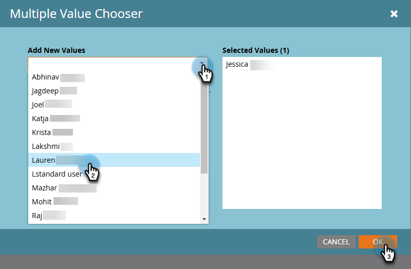

# メールデザイナーの概要 {#overview}

新しい Adobe Marketo Engage メールデザイナーへようこそ。

メールデザイナーは、Marketo Engage の最新のイノベーションです。視覚的なドラッグ＆ドロップエディターと標準テンプレートを提供することで、生産性と効率性を向上させるために改良されたメールとメールテンプレートの作成エクスペリエンスを実現します。 ベンダーに費用をかけずに、カスタマイズされたメールテンプレートを簡単に作成できます。

## アクセス方法 {#how-to-access}

+++メールデザイナーへのアクセス方法の詳細情報

新しいメールデザイナーにアクセスするには、Marketo Engage サブスクリプションを [Adobe Identity Management システム（IMS）](https://experienceleague.adobe.com/ja/docs/marketo/using/product-docs/administration/marketo-with-adobe-identity/adobe-identity-management-overview)に移行する必要があります。 まだ移行しておらず、迅速な対応をリクエストする場合は、アドビのアカウントチーム（担当のアカウントマネージャー）または [Marketo サポート](https://nation.marketo.com/t5/support/ct-p/Support)にお問い合わせください。

### ユーザの追加 {#add-users}

1. Marketo Engage で、**[!UICONTROL 管理]**&#x200B;エリアに移動し、「**[!UICONTROL 新しいメールデザイナー]**」を選択します。

   {width="600" zoomable="yes"}

1. 「**[!UICONTROL ユーザを追加]**」をクリックします。

   {width="600" zoomable="yes"}

1. **[!UICONTROL 新しい値を追加]**&#x200B;ドロップダウンで、目的のユーザを選択します。 終了したら、「**[!UICONTROL OK]**」をクリックします。

   {width="600" zoomable="yes"}

+++

## 人気の記事 {#popular-articles}

### はじめに {#getting-started}

* [メールオーサリング](/help/marketo/product-docs/email-marketing/email-designer/email-authoring.md){target="_blank"}：新しいエディターでメールを作成、デザイン、参照する方法について説明します。

* [メールテンプレートオーサリング](/help/marketo/product-docs/email-marketing/email-designer/email-template-authoring.md){target="_blank"}：新しいエディターでメールテンプレートを作成、デザイン、アクセスする方法について説明します。

* [フラグメント](/help/marketo/product-docs/email-marketing/email-designer/fragments.md){target="_blank"}：メールおよびメールテンプレートの再利用可能なコンポーネントとしてビジュアルコンテンツフラグメントを作成および使用する方法について説明します。

### 新機能 {#new-features}

* [画像から HTML へのコンバーター](/help/marketo/product-docs/email-marketing/email-designer/feature-comparison.md){target="_blank"}：あるメールの互換 PNG／JPEG 画像ファイルをアップロードすると、HTML へと自動的に変換され、新しい E メールデザイナーできるようになります。

* [ブランドテーマ](/help/marketo/product-docs/email-marketing/email-designer/brands/brand-themes.md){target="_blank"}：Marketo Engage 内でブランドテーマを定義します。 ブランドの一貫性を確保するために、メールテンプレートやその他のメールアセットをまたいでスタイル設定を再利用および適用できます。

* [テンプレートインポーター](/help/marketo/product-docs/email-marketing/email-designer/import-template.md){target="_blank"}：クラシックメールエディターからメールテンプレートを読み込んで、デザインスタジオの新しい E メールデザイナーと互換性のあるテンプレートを作成します。

* [条件付きコンテンツ](/help/marketo/product-docs/email-marketing/email-designer/conditional-content.md){target="_blank"}：新しい E メールデザイナーのパリティ機能により、トークン以外でもメールのパーソナライゼーションを実現できます。

## よくある質問 {#faq}

**従来の電子メールエディターはいつ廃止されますか？**

クラシックエディターは最終的には非推奨になりますが、現時点では特定の日付はありません。 ただし、非推奨化の前に&#x200B;_か月_&#x200B;か月の通知が行われます。

**新しいメールデザイナーのメールは、どのプログラムで使用できますか？**

新しいメールデザイナーのメールは、すべてのプログラムをまたいでアクセスできます（唯一の例外はインタラクティブウェビナープログラムです）。 クローン作成も使用できます。

**既存のメールテンプレートは新しいデザイナーで機能しますか？**

はい、ただし[読み込む必要](/help/marketo/product-docs/email-marketing/email-designer/import-template.md)があります。

**新しいデザイナーアセットを別のプログラムに簡単に移動できますか？**

はい。

**新しいメールデザイナーでは API 経由でアセットを編集できますか？**

現時点では、API 経由で編集されているアセットは、新しいメールデザイナーではサポートされていません。

**ブランディング（フォント、ロゴ、カラー）を適用する方法はありますか？**

はい、あります。 [ブランドテーマ](/help/marketo/product-docs/email-marketing/email-designer/brands/brand-themes.md)を使用して、ブランドガイドラインを作成および管理します。

**テンプレートのモジュールを作成すると、よりカスタマイズ可能で拡張性が高くなりますか？**

WYSIWYGのエディターは、より詳細にカスタマイズできます。

**新しいデザイナーでは、メールテンプレートの作成プロセスはどのように機能しますか？ これは WYSIWYG ですか？または HTML の知識が必要ですか？**

これは WYSIWYG です。HTML の知識は必要ありません。 デザイナーでテンプレートを簡単に作成できるので、外部の web 開発者の必要性が軽減されます。 ただし、CSS を更新し、HTML 経由で個々のセクションを編集するオプションは引き続きあります。

**新しいメールデザイナーは、AMP 言語をサポートしていますか？**

現時点では、AMP をサポートしていません。

**Marketo Engage サブスクリプションが IMS（Adobe Admin Console）に移行されたかどうかを確認するにはどうすればよいですか？**

[Adobe Experience Cloud](https://experienceleague.adobe.com/ja){target="_blank"} 経由で Marketo Engage にログインすると、サブスクリプションは移行されています。

**新しいメールデザイナーでは、どのブラウザーを使用できますか？**

現時点では、Google Chrome、Apple Safari、Microsoft Edge、Mozilla Firefox のいずれかを使用することをお勧めします。
