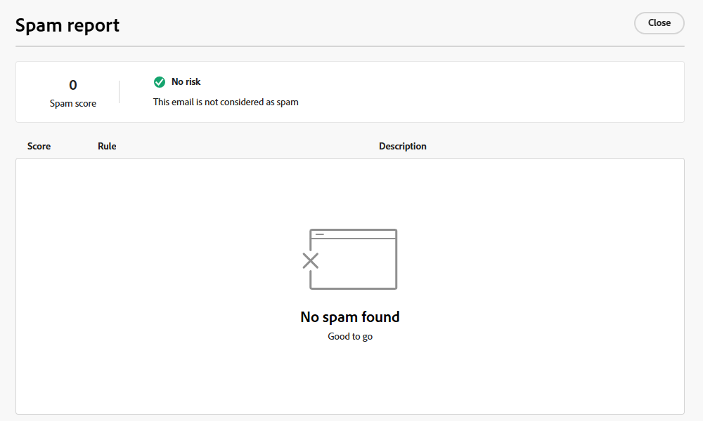

# メールスパムレポート {#email-spam-report}

Marketo EngageでSpamAssassinを使用すると、メールコンテンツをテストし、ISP/メールボックスプロバイダーが迷惑メールとしてマークする可能性を確認できます。

SpamAssassinはコンテンツを分析し、さまざまな基準にもとづいてスコアを割り当てます。 スコアが低いほど、より良い結果が得られます。 スコアが高い電子メールを送信すると、全体的な配信品質に悪影響を与える可能性があるため、スコアを低く維持することが重要です。

## スパムレポートへのアクセス {#access-the-spam-report}

1. メールで、**コンテンツをシミュレート**&#x200B;をクリックします。

   {width="600" zoomable="yes"}

   >[!NOTE]
   >
   >まだテストプロファイルを追加していない場合は、手順1の直後に追加する必要があります。

1. 「**スパムレポート**」ボタンをクリックします。

   

1. スパムレポートが生成されます。

   {width="600" zoomable="yes"}

1. 各項目のスコアと説明を確認します。

   >[!IMPORTANT]
   >
   >全体的なスコアが5を超えると、受信者が電子メールをブロックしたり、迷惑メールとしてマークしたりする可能性があります。

1. スコアが高すぎると思われる場合は、レポートの結果に基づいて電子メール Designerのコンテンツを編集してから、**スパムレポート**&#x200B;を再実行してください。

   {width="800" zoomable="yes"}

スコアが自分の好みに合ったら、送信する準備ができました。

{width="800" zoomable="yes"}

>[!NOTE]
>
>スパムスコアはSpamAssassinを通じて取得されます。また、**ルールはAdobe**&#x200B;によって所有されていません。 これらのルールの詳細については、[SpamAssassin ドキュメント ](https://spamassassin.apache.org/#_blank){target="_blank"}を参照してください。 エラー[の完全なリストは、ここで確認できます](https://spamassassin.apache.org/old/tests_3_0_x.html){target="_blank"}。
