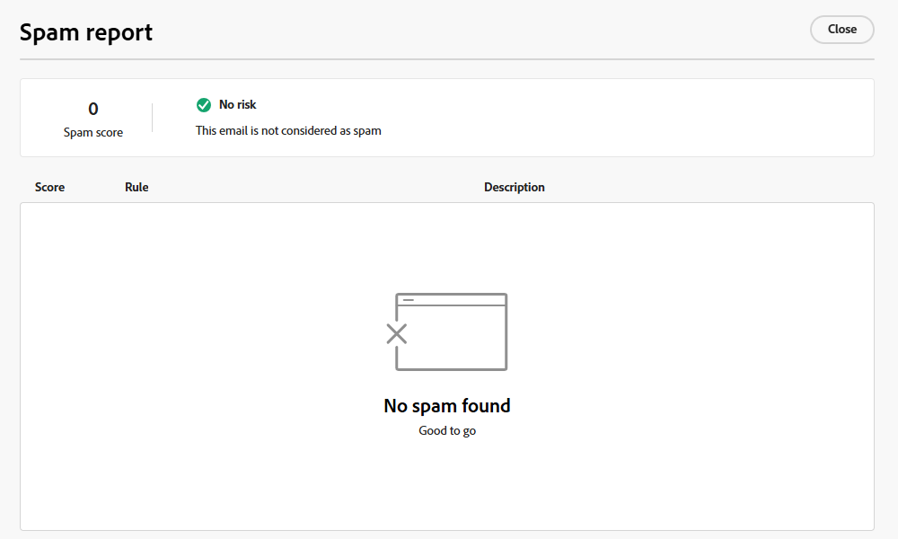

# メールスパムレポート {#email-spam-report}

Marketo Engageで SpamAssassin を使用すると、メールコンテンツをテストし、ISP/メールボックスプロバイダーがスパムとしてマークする可能性を確認できます。

SpamAssassin はコンテンツを分析し、様々な条件に基づいてスコアを割り当てます。 スコアが低いほど、より良い結果が得られます。 高いスコアのメールを送信すると、配信品質全体に悪影響を与える可能性があるので、低いスコアを維持することが重要です。

## スパムレポートへのアクセス {#access-the-spam-report}

1. メール内で、「**コンテンツをシミュレート**」をクリックします。

   {width="600" zoomable="yes"}

   >[!NOTE]
   >
   >テストプロファイルをまだ追加していない場合は、手順 1 の直後に追加する必要があります。

1. 「**スパムレポート** ボタンをクリックします。

   

1. スパムレポートが生成されます。

   {width="600" zoomable="yes"}

1. 各項目のスコアと説明を確認します。

   >[!IMPORTANT]
   >
   >全体のスコアが 5 を超える場合、メールがブロックされたり、配信時にスパムと見なされる可能性があります。

1. スコアが高すぎると思われる場合は、レポートの結果に基づいて電子メールDesignerのコンテンツを編集し、**スパムレポート** を再実行します。

   {width="800" zoomable="yes"}

スコアが自分の好みに合ったら、送信する準備が整います。

{width="800" zoomable="yes"}

>[!NOTE]
>
>スパムスコアは SpamAssassin によって得られ、ルールはAdobeによって所有されません。 これらのルールについて詳しくは、[SpamAssassin ドキュメント ](https://spamassassin.apache.org/#_blank){target="_blank"} を参照してください。 エラーの完全なリスト [ こちらを参照 ](https://spamassassin.apache.org/old/tests_3_0_x.html){target="_blank"}。
