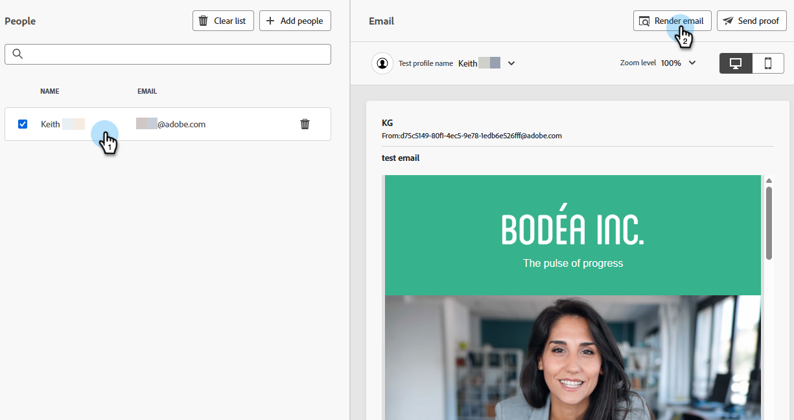
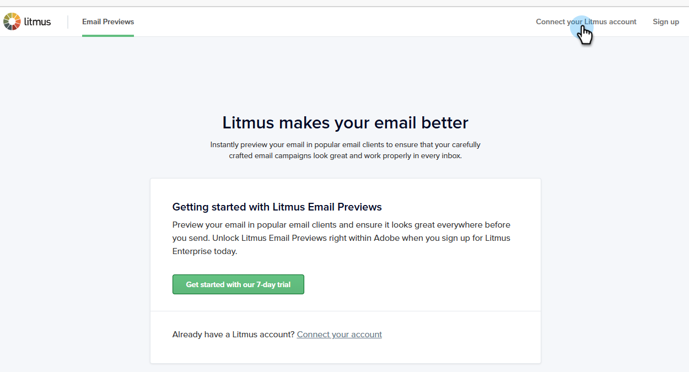
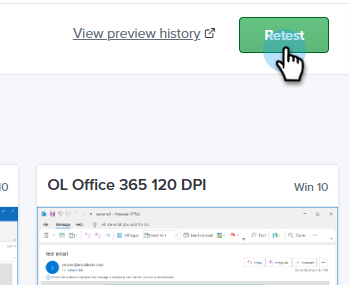
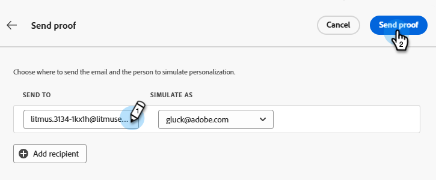

# Litmus を使用したメールのレンダリングのテスト {#test-email-rendering-with-litmus}

Marketo Engageの[Litmus](https://www.litmus.com/email-testing) アカウントを活用して、人気のあるメールクライアントでのメールのレンダリングを即座に確認します。

>[!AVAILABILITY]
>
>この機能は、アクティブなLitmus アカウントを持つすべてのMarketo Engage ユーザーが利用できます。

## Litmus Enterprise ユーザー {#litmus-enterprise}

次の手順は、[Litmus エンタープライズ プラン &#x200B;](https://www.litmus.com/pricing/enterprise){target="_blank"}のユーザー向けです。

1. _メールコンテンツを編集_&#x200B;画面で、「**コンテンツをシミュレート**」ボタンをクリックします。

   

1. テスト受信者を選択し、「**メールをレンダリング**」ボタンをクリックします。

   {width="800" zoomable="yes"}

1. まだ使用していない場合は、**Litmus アカウントを接続します**。 既に実行している場合は、手順6に進んでください。

   {width="800" zoomable="yes"}

1. Litmusの資格情報を入力し、**ログイン**&#x200B;をクリックします。

   >[!IMPORTANT]
   >
   >Litmus アカウントをMarketo Engageに接続すると、テストメールがLitmusに送信されることに同意したことになります。 送信後、これらのテストメールはAdobeで管理されなくなります。 そのため、Litmusのデータ保持メールポリシーは、それらのメールに含まれる可能性のあるパーソナライゼーションデータを含め、それらのメールに適用されます。

1. **Connect**&#x200B;をクリックして統合を完了します。

   

1. 「**テストを実行**」ボタンをクリックして、メールのプレビューを生成します。

1. デスクトップ、モバイル、web ベースの一般的なメールクライアントで、コンテンツがどのように表示されるかをご確認ください。 プレビューするサムネールをクリックします。

   {width="800" zoomable="yes"}

   >[!NOTE]
   >
   >デフォルトのメールクライアントリストを[&#x200B; カスタマイズする方法について説明します](https://help.litmus.com/article/227-change-your-default-email-clients-list)。

1. テストが完了したら、左上の後方矢印をクリックして、_コンテンツをシミュレート_&#x200B;画面に戻ります。

   

**オプション手順**：電子メールに変更を加える場合は、**電子メールをレンダリング**&#x200B;をクリックして表示した後、Litmus _電子メールプレビュー_&#x200B;画面の右上にある「**再試行**」ボタンもクリックしてください。

## Litmus コアユーザー {#litmus-core}

次の手順は、[Litmus コアプラン &#x200B;](https://www.litmus.com/pricing/){target="_blank"}のユーザー向けです。

1. Litmus アカウントで、_テスト_&#x200B;画面の「**テストアドレスをコピー**」ボタンをクリックして、テストメールアドレスを取得します。

   {width="800" zoomable="yes"}

1. Marketo Engageで、目的の電子メールの&#x200B;_電子メールコンテンツを編集_&#x200B;画面に移動し、「**コンテンツをシミュレート**」ボタンをクリックします。

   {width="600" zoomable="yes"}

1. テスト受信者を選択し、**プルーフを送信** ボタンをクリックします。

   {width="800" zoomable="yes"}

1. 手順1でコピーしたLitmus電子メールアドレスを入力し、**プルーフを送信**&#x200B;をもう一度クリックします。

   

1. Litmus アカウント内（Litmusからコピーしたメールアドレスに対応するフォルダー内）のメールを確認します。

   {width="800" zoomable="yes"}
