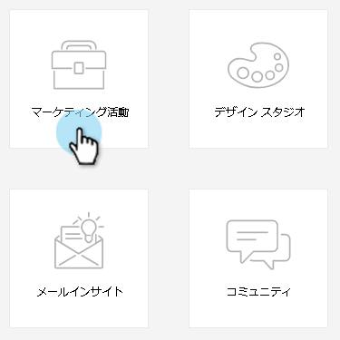

# 電子メールプログラムの作成{#create-an-email-program}

電子メールプログラムを使用して、複数の人に簡単かつ迅速に電子メールを送信できます。

1. **マーケティングアクティビティ**&#x200B;に移動します。

   

1. プログラムを作成するフォルダーを選択し、「**新規**」ドロップダウンをクリックし、「**新規プログラム**」を選択します。

   

1. 「名前」を入力し、「プログラムタイプ」に「**電子メール**」を選択して、「**作成**」をクリックします。

   

   >[!NOTE]
   >
   >「プログラムの種類」に「**電子メール**」を選択すると、チャネルは自動的に「**電子メール送信**」に設定されます。 必要に応じて変更できます。

   

ナイス！ プログラムがツリーに表示され、使用できる状態になっていることに注意してください。 次のステップは、オーディエンスを定義することです。 以下のマーケティング関連記事を参照してください。

>[!MORELIKETHIS]
>
>* [スマートリストを使用したオーディエンスの定義](/help/marketo/product-docs/email-marketing/email-programs/managing-people-in-email-programs/define-an-audience-with-a-smart-list.md)
>* [リストのインポートによるオーディエンスの定義](/help/marketo/product-docs/email-marketing/email-programs/managing-people-in-email-programs/define-an-audience-by-importing-a-list.md)

