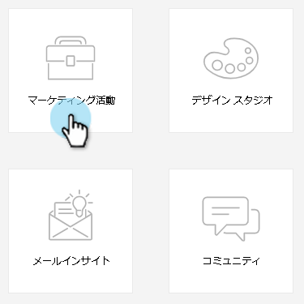

# メールプログラムの作成 {#create-an-email-program}

メールプログラムを使用して、メールをグループにすばやく簡単に送信できます。

1. **[!UICONTROL マーケティングアクティビティ]**&#x200B;に移動します。

   

1. プログラムを作成するフォルダーを選択し、**[!UICONTROL 新規]**&#x200B;ドロップダウンで、「**[!UICONTROL 新規プログラム]**」を選択します。

   

1. 名前を入力し、「[!UICONTROL プログラムタイプ]」として「**[!UICONTROL メール]**」を選択し、「**[!UICONTROL 作成]**」をクリックします。

   

   >[!NOTE]
   >
   >「プログラムタイプ」として「**[!UICONTROL メール]**」を選択すると、「チャネル」は自動的に「**[!UICONTROL メール送信]**」に設定されます。 必要に応じてこれを変更できます。

   

作業は以上です。 プログラムがツリーに表示され、使用できる状態になります。 次の手順では、オーディエンスを定義します。 以下の Marketo 関連記事を参照してください。

>[!MORELIKETHIS]
>
>* [スマートリストを使用したオーディエンス定義](/help/marketo/product-docs/email-marketing/email-programs/managing-people-in-email-programs/define-an-audience-with-a-smart-list.md)
>* [リスト読み込みによるオーディエンスの定義](/help/marketo/product-docs/email-marketing/email-programs/managing-people-in-email-programs/define-an-audience-by-importing-a-list.md)
