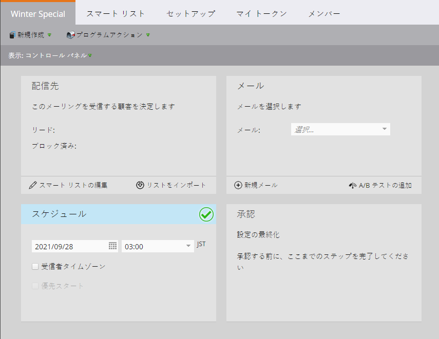

# 電子メールプログラムについて {#understanding-email-programs}

新しいMarketoの友人、電子メールプログラムにこんにちはと言ってください。 電子メールを送信し、A/Bテストを作成し、結果をすべて1か所で追跡します。

## Campaign コントロールパネル {#control-panel}

4つのボックスが集中を保ちます。 **オーディエンス** は「who」を定義し、 **電子メールは「what」を** 提供し、 **Scheduleは「when」を定義し、** Approvalは **** 「whe」を設定します。

## A/Bテスト {#a-b-testing}

A/Bテストを使用すると、最適な電子メールを検証できます。

以下のA/Bテストについて説明します。

* [「件名」A/Bテスト](../../../../product-docs/email-marketing/email-programs/email-program-actions/email-test-a-b-test/use-subject-line-a-b-testing.md)
* [「電子メール全体」のA/Bテスト](../../../../product-docs/email-marketing/email-programs/email-program-actions/email-test-a-b-test/use-whole-email-a-b-testing.md)
* [「送信者アドレス」 A/Bテスト](../../../../product-docs/email-marketing/email-programs/email-program-actions/email-test-a-b-test/use-from-address-a-b-testing.md)
* [「日付/時刻」 A/Bテスト](../../../../product-docs/email-marketing/email-programs/email-program-actions/email-test-a-b-test/use-date-time-a-b-testing.md)

## ダッシュボード {#dashboards}

>[!TIP]
>
>プログラムの詳細なレポートダッシュボードが原因で、スマートキャンペーン経由で電子メールを送信するよりも電子メールプログラムを使用した方が望ましい場合があります。

労を尽し給え。 ダッシュボードには、電子メールプログラムとA/Bテストのパフォーマンスが一目でわかります。   

## 入れ子 {#nesting}

電子メールプログラムは他のプログラムとうまく連携します。

例えば、電子メールプログラムを使用してウェビナーへの招待を送信します。

デフォルトのプログラム内で電子メールプログラムを使用して、内容を整理します。

>[!TIP]
>
>既存の電子メールプログラムを別のプログラムに取り込むには、その電子メールをコピーする必要があります。

>[!NOTE]
>
>電子メールプログラムは、 [エンゲージメントプログラム内にネストできません](../../../../getting-started/quick-wins/drip-drip-nurture.md)。 また、再送信できず、一度に1つのテストしか実行できません。

## スケジュール設定 {#schedule-settings}

電子メールのプログラムについて理解したら、以下の関連記事の1つから始めます。

>[!MORELIKETHIS]
>
>* [電子メールプログラムの作成](create-an-email-program.md)
   >
   >
* [スマートリストを使用したオーディエンスの定義](../../../../product-docs/email-marketing/email-programs/managing-people-in-email-programs/define-an-audience-with-a-smart-list.md)
>* [電子メールプログラム用の電子メールの作成](../../../../product-docs/email-marketing/email-programs/email-program-actions/create-an-email-for-an-email-program.md)
>* [電子メールプログラムのスケジュール](../../../../product-docs/email-marketing/email-programs/email-program-actions/schedule-your-email-program.md)

>

