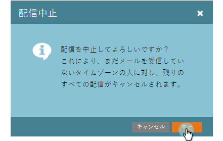
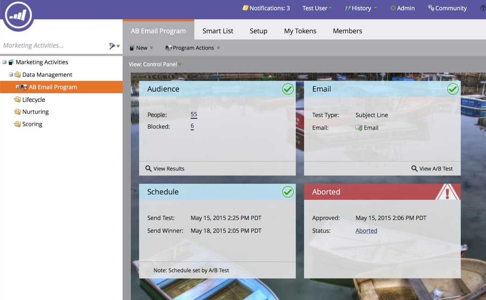

# メールプログラムの中止 {#abort-email-program}

エラー！ブレーキを踏め！ この電子メールプログラムは外出禁止です。

>[!NOTE]
>
>この記事は、電子メールが送信される前に送信されないようにするためのものです。 送信されたメールを呼び出す方法はありません。

1. 電子メールプログラムで、「**プログラムを中止**」をクリックします。

   

1. 「**中止**」をクリックすると、完全な確認が表示されます。

   

1. この電子メールプログラムが中止されたことを示す警告ヘッダーが表示されます。

   

   >[!CAUTION]
   >
   >電子メールプログラムを中止すると、再スケジュールできなくなります。

フー！ その高価なミスを避けられて嬉しくない？
