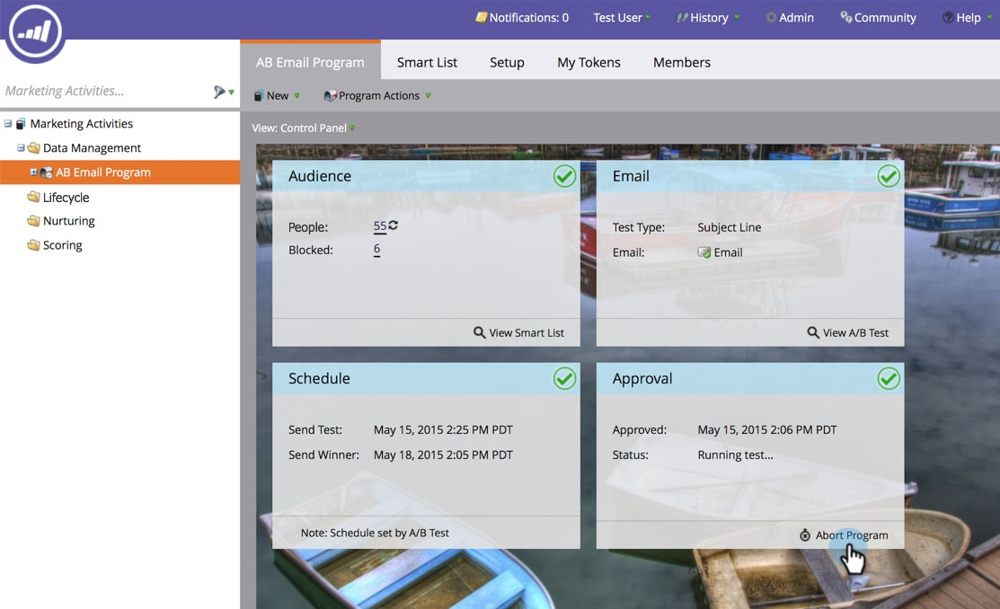
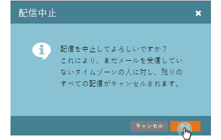

# メールプログラムの中止 {#abort-email-program}

おっと、ブレーキを引いてください。このメールプログラムは外部に出てはいけません。

>[!NOTE]
>
>この記事は、メールが送信されるのを送信前に防ぐためのものです。送信済みのメールを取り消す方法はありません。

1. メールプログラムで、「**[!UICONTROL プログラムを中止]**」をクリックします。

   

1. 「**[!UICONTROL 中止]**」をクリックして確認します。

   

1. このメールプログラムが中止されたことを示すアラートヘッダーが表示されます。

   

   >[!CAUTION]
   >
   >メールプログラムを中止すると、スケジュールを再設定できなくなります。

危なかったです。高くつく間違いを避けることができて良かったですね。
