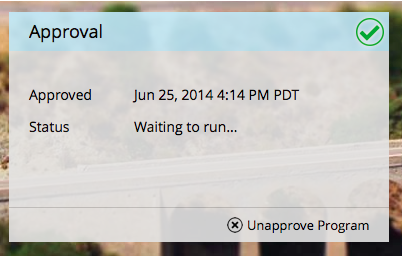

# メールプログラムを承認／承認取消する {#approve-unapprove-an-email-program}

>[!PREREQUISITES]
>
>* [メールプログラムを作成する](/help/marketo/product-docs/email-marketing/email-programs/creating-an-email-program/create-an-email-program.md)
>* [スマートリストを使用してオーディエンスを定義する](/help/marketo/product-docs/email-marketing/email-programs/managing-people-in-email-programs/define-an-audience-with-a-smart-list.md)または[リストをインポートしてオーディエンスを定義する](/help/marketo/product-docs/email-marketing/email-programs/managing-people-in-email-programs/define-an-audience-by-importing-a-list.md)

* [既存のメールを選択する](/help/marketo/product-docs/email-marketing/email-programs/email-program-actions/choose-an-existing-email.md)または[新規メールを作成する](/help/marketo/product-docs/email-marketing/email-programs/email-program-actions/create-an-email-for-an-email-program.md)

* [メールプログラムのスケジュールを設定する](/help/marketo/product-docs/email-marketing/email-programs/email-program-actions/schedule-your-email-program.md)

## メールプログラムを承認する {#approve-your-email-program}

プログラムの準備が整ったので、最後の手順はプログラムを承認することです。その方法をご紹介します。

1. 「**マーケティングアクティビティ**」に移動します。

   

   メールプログラムを選択します。
   

   >[!CAUTION]
   >
   >メールプログラムを承認しない場合、メールは送信されません。

1. 「**承認**」タイルの下で、「**プログラムの承認**」をクリックします。

   

1. 問題があれば通知が表示されます。修正のうえ、再度承認してください。

   

   完璧です。これで終了です。メールは予定時刻に送信されます。

   

## メールプログラムの承認を取り消す {#unapprove-your-email-program}

気が変わって、メールを送りたくなくなった場合は、メールプログラムの承認を取り消すことができます。

1. 「**マーケティングアクティビティ**」に移動します。

   

1. メールプログラムを選択します。

   

1. 「**承認**」タイルで「**プログラムの承認を取り消す**」をクリックします。

   

これだけです。再度承認するまで、メールは送信されません。
