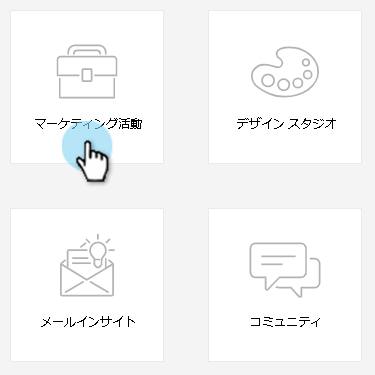
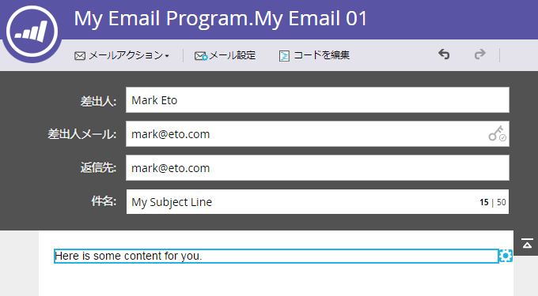

# 電子メールプログラム用の電子メールの作成 {#create-an-email-for-an-email-program}

>[!NOTE]
>
>**前提条件**
>
>* [電子メールプログラムの作成](/help/marketo/product-docs/email-marketing/email-programs/creating-an-email-program/create-an-email-program.md)
>* [スマートリストを使用したオーディエンスの定義](/help/marketo/product-docs/email-marketing/email-programs/managing-people-in-email-programs/define-an-audience-with-a-smart-list.md) 、またはリストのインポートによるオーディエンスの [定義](/help/marketo/product-docs/email-marketing/email-programs/managing-people-in-email-programs/define-an-audience-by-importing-a-list.md)

>

電子メールプログラムを作成し、オーディエンスを定義したら、送信する電子メールを決定します。 既存の電子メールを [選択するか](choose-an-existing-email.md) 、または新規に作成できます。 新しい電子メールの作成方法を次に示します。

1. 「 **マーケティングアクティビティ**」に移動します。

   

1. 電子メールプログラムを選択します。 「 **電子メール** 」タイルの下にある「 **新規電子メール**」をクリックします。

   

1. 「 **名前**」を入力し、目的のテンプレートを選択して、「 **作成**」をクリックします。

   

1. 必要な変更をすべて行い、エディターを閉じます。

   

   >[!NOTE]
   >
   >電子メール内の要素を [編集する方法を説明します](/help/marketo/product-docs/email-marketing/general/email-editor-2/edit-elements-in-an-email.md)。

1. メールを承認するのを忘れないでください。

   

素晴らしい！ 送信する電子メールを作成しました。A/Bテストを [追加するか](email-test-a-b-test/add-an-a-b-test.md) 、まずEメールプログラムの [スケジュールをスキップします](schedule-your-email-program.md)。

>[!MORELIKETHIS]
>
>* [A追加/Bテスト](email-test-a-b-test/add-an-a-b-test.md)
>* [電子メールプログラムのスケジュール](schedule-your-email-program.md)

