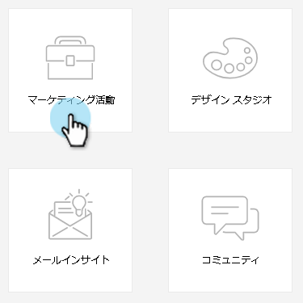
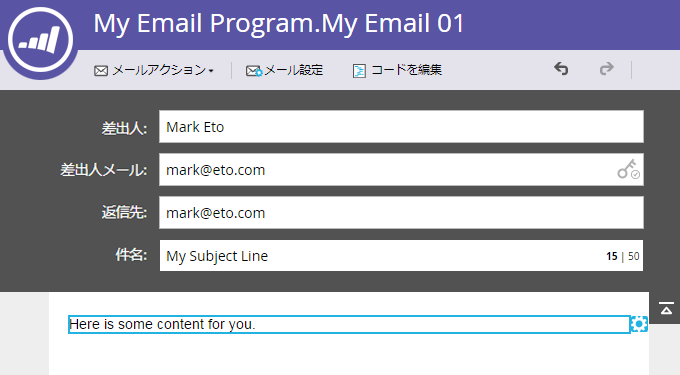
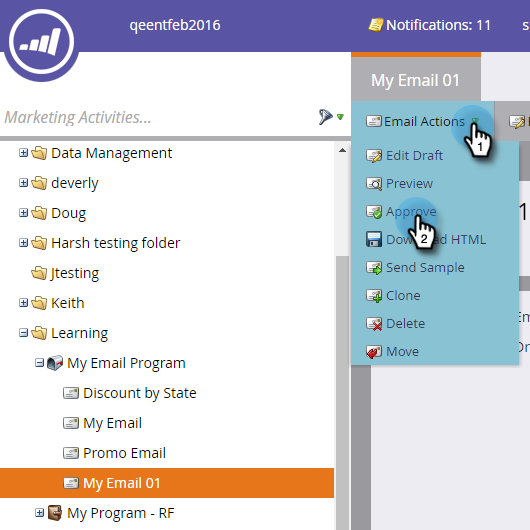

# メールプログラム向けメールの作成 {#create-an-email-for-an-email-program}

>[!PREREQUISITES]
>
>* [メールプログラムの作成](/help/marketo/product-docs/email-marketing/email-programs/creating-an-email-program/create-an-email-program.md)
>* [スマートリストを使用してオーディエンスを定義する](/help/marketo/product-docs/email-marketing/email-programs/managing-people-in-email-programs/define-an-audience-with-a-smart-list.md)または[リストをインポートしてオーディエンスを定義する](/help/marketo/product-docs/email-marketing/email-programs/managing-people-in-email-programs/define-an-audience-by-importing-a-list.md)

メールプログラムを作成し、オーディエンスを定義したら、どのようなメールを送信するのかを決定します。 [既存のメールを選択](/help/marketo/product-docs/email-marketing/email-programs/email-program-actions/choose-an-existing-email.md)またはゼロから作成します。 メールを新規作成する方法を次に示します。

1. **[!UICONTROL マーケティングアクティビティ]**&#x200B;に移動します。

   

1. メールプログラムを選択します。 **[!UICONTROL メール]**&#x200B;タイルの下で、「**[!UICONTROL 新規メール]**」をクリックします。

   

1. **[!UICONTROL 名前]**&#x200B;を入力します。望まれるテンプレートを選択し、「**[!UICONTROL 作成]**」をクリックします。

   

1. 必要な変更をすべておこない、エディターを閉じます。

   

   >[!NOTE]
   >
   >[メールの要素の編集](/help/marketo/product-docs/email-marketing/general/email-editor-2/edit-elements-in-an-email.md)方法を学びます。

1. 忘れずにメールを承認してください。

   

これで完了です。 送信するメールを作成したので、[A/B テストを追加](/help/marketo/product-docs/email-marketing/email-programs/email-program-actions/email-test-a-b-test/add-an-a-b-test.md)する、またはスキップして[メールプログラムをスケジュール](/help/marketo/product-docs/email-marketing/email-programs/email-program-actions/schedule-your-email-program.md)します。
