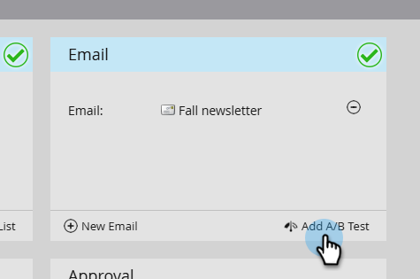

# A/B テストの追加 {#add-an-a-b-test}

>[!PREREQUISITES]
>
>* [メールプログラムの作成](/help/marketo/product-docs/email-marketing/email-programs/creating-an-email-program/create-an-email-program.md)
>* [スマートリストを使用してオーディエンスを定義する](/help/marketo/product-docs/email-marketing/email-programs/managing-people-in-email-programs/define-an-audience-with-a-smart-list.md)または[リストをインポートしてオーディエンスを定義する](/help/marketo/product-docs/email-marketing/email-programs/managing-people-in-email-programs/define-an-audience-by-importing-a-list.md)
>
>* [既存のメールを選択する](/help/marketo/product-docs/email-marketing/email-programs/email-program-actions/choose-an-existing-email.md)または[新規メールを作成する](/help/marketo/product-docs/email-marketing/email-programs/email-program-actions/create-an-email-for-an-email-program.md)

テストは、エンゲージメント向上のためにメールを最適化する絶好の機会です。 テストは次のように開始できます。

1. **[!UICONTROL マーケティングアクティビティ]**&#x200B;に移動します。

   

1. メールプログラムを選択します。

   

1. **[!UICONTROL メール]**&#x200B;タイルの下で、「**[!UICONTROL A/B テストを追加]**」をクリックします。

   

   >[!NOTE]
   >
   >A/B テストを追加すると、選択したメールは他のプログラムで使用できなくなります。

1. 新しいウィンドウが開き、**テストタイプ**&#x200B;から選択できます。 続行するには、以下の関連記事の 1 つを参照してください。

   >[!CAUTION]
   >
   >データベースに重複したレコードがある場合、それらのレコードはテストと成功のメールの&#x200B;**両方**&#x200B;を受信します。 この問題が発生しないようにするには、データベースで[重複ユーザーを検索して結合](/help/marketo/product-docs/core-marketo-concepts/smart-lists-and-static-lists/managing-people-in-smart-lists/find-and-merge-duplicate-people.md)します。

>[!MORELIKETHIS]
>
>* [「件名」A/B テストの使用](/help/marketo/product-docs/email-marketing/email-programs/email-program-actions/email-test-a-b-test/use-subject-line-a-b-testing.md)
>* [「メール全体」A/B テストの使用](/help/marketo/product-docs/email-marketing/email-programs/email-program-actions/email-test-a-b-test/use-whole-email-a-b-testing.md)
>* [「送信元アドレス」A/B テストの使用](/help/marketo/product-docs/email-marketing/email-programs/email-program-actions/email-test-a-b-test/use-from-address-a-b-testing.md)
>* [「日付／時間」A/B テストの使用](/help/marketo/product-docs/email-marketing/email-programs/email-program-actions/email-test-a-b-test/use-date-time-a-b-testing.md)
