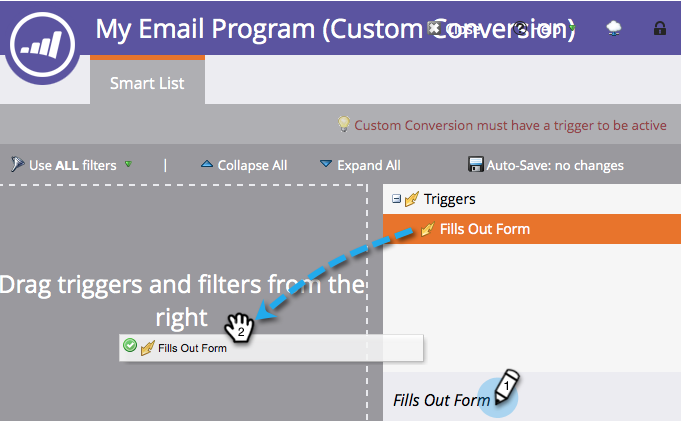

# A/B テストの勝者条件の定義 {#define-the-a-b-test-winner-criteria}

条件 [A/B テストの追加](/help/marketo/product-docs/email-marketing/email-programs/email-program-actions/email-test-a-b-test/add-an-a-b-test.md){target=&quot;_blank&quot;} をメールプログラムに追加する場合は、テストタイプを選択する必要があります。 [A/B テストのスケジュール設定](/help/marketo/product-docs/email-marketing/email-programs/email-program-actions/email-test-a-b-test/schedule-the-a-b-test.md){target=&quot;_blank&quot;} を設定し、勝者の条件を定義します。 どのメールが優先されるかを決定する方法を次に示します。

>[!PREREQUISITES]
>
>[A/B テストの追加](/help/marketo/product-docs/email-marketing/email-programs/email-program-actions/email-test-a-b-test/add-an-a-b-test.md){target=&quot;_blank&quot;}

## 勝者の条件 {#winner-criteria}

1. デフォルトの&#x200B;**勝者の条件**&#x200B;オプションが最初に表示されます。

   

   <table>
   <tr>
   <td><b>開封</b></td>
   <td>メールに画像がダウンロードされると、開封が登録されます。画像を含めていなくても、デフォルトで Marketo がすべての HTML メールに 1 つのトラッキングピクセルを挿入します。</td>
   </tr>
   <tr>
   <td><b>クリック</b></td>
   <td>デフォルトでは、メール内のリンクにはトラッキング情報が埋め込まれており、誰がどのリンクをクリックしたか、リンクが合計で何回クリックされたかなどを確認できます。</td>
   </tr>
   <tr>
   <td><b>クリック/開封率 %</b></td>
   <td>開封され、メール内のリンクがクリックされたメールの割合。これは、ユニーククリック数をユニーク開封数で割り、100 倍してパーセンテージとして表示することで、メールの関連性とコンテキストを測定します。</td>
   </tr>
   <tr>
   <td><b>エンゲージメントスコア</b></td>
   <td><a href="https://experienceleague.adobe.com/docs/marketo/using/product-docs/email-marketing/drip-nurturing/reports-and-notifications/understanding-the-engagement-score.html" target="_blank">エンゲージメントスコア</a>は、コンテンツの効果を判断するのに役立ちます。</td>
   </tr>
   </table>

   >[!TIP]
   >
   >「エンゲージメントスコア」を選択した場合、テストは 24 時間以上実行する必要があります。詳細情報： [エンゲージメントスコアについて](/help/marketo/product-docs/email-marketing/drip-nurturing/reports-and-notifications/understanding-the-engagement-score.md){target=&quot;_blank&quot;}。

1. また、「カスタムコンバージョン」を選択して「編集」をクリックすることで、条件をカスタマイズすることもできます。

   

   >[!NOTE]
   >
   >カスタムコンバージョンでは、トリガーとフィルターを使用して、任意のイベントをコンバージョンとして設定できます。

1. ウィンドウがポップ表示されます。任意のトリガーを見つけ、キャンバスにドラッグします。

   

1. トリガーを定義します。

   

   >[!IMPORTANT]
   >
   >Marketoでは、このメールプログラムからメールを送信した人のトリガー/フィルターのみを使用できるので、「メール送信済み」フィルターを追加する必要はありません。 また、電子メール関連のトリガー/フィルターを使用する場合は、必ず「任意」を演算子として使用してください。

1. 「**閉じる**」をクリックします。

   

   完成です。次に、勝者の決定方法を決めます。

## 勝者の発表 {#declare-winner}

1. 2 つの使用可能なオプションの 1 つを選択します。

   

   >[!NOTE]
   >
   >**日時** A/B テストをおこなう場合、選択できるのは&#x200B;**手動**&#x200B;のみです。

   A/B テストが終了すると、スケジュールされた時刻に勝者のメールが自動的に送信されるようにできます。または、結果を確認して、どのメールを送信するかを決定できます。

1. 「自動」はすばらしいもので、デフォルトのオプションになっています。「**次へ**」をクリックします。

   

   >[!TIP]
   >
   >「**手動**」を選択すると、テストが送信され、勝者の発表を待機します。結果のレポートが届きます。

完璧です。次に、 [A/B テストのスケジュール設定](/help/marketo/product-docs/email-marketing/email-programs/email-program-actions/email-test-a-b-test/schedule-the-a-b-test.md){target=&quot;_blank&quot;}。
