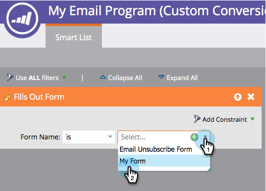

# A/Bテストの推奨結果条件の定義 {#define-the-a-b-test-winner-criteria}

電子メールプログラムにA/Bテスト [を](add-an-a-b-test.md) 追加する場合 [、テストタイプを選択し、A/Bテストを](schedule-the-a-b-test.md)スケジュールして、勝者条件を定義する必要があります。 どの電子メールの勝利を決定する方法を示します。

>[!NOTE]
>
>**前提条件**
>
>* [A追加/Bテスト](add-an-a-b-test.md)

>

## 勝者の条件 {#winner-criteria}

1. デフォルトの **勝者条件** (Winner Criteria)オプションが最初に表示されます。

   

   | **開く** | openは、画像が電子メールにダウンロードされると登録します。 画像を含めない場合でも、デフォルトでは、MarketorはすべてのHTML電子メールに1つのトラッキングピクセルを挿入します。 |
   |---|---|
   | **クリック数** | デフォルトでは、電子メール内のリンクにトラッキングが埋め込まれており、電子メール内のリンクは、誰がどのリンクをクリックしたか、合計クリックされた数などを確認できます。 |
   | **クリックして開く%** | 電子メール内で開かれ、リンクがクリックされた電子メールの割合。 ここでは、個別クリック数を個別オープン数で割った値を100に乗算して割合として表示することで、電子メールの関連性とコンテキストを測定します。 |
   | **エンゲージメントスコア** | エン [ゲージメントスコアは](http://docs.marketo.com/display/DOCS/Understanding+the+Engagement+Score) 、コンテンツの効果を判断するのに役立ちます。 |

   >[!TIP]
   >
   >「エンゲージメントスコア」を選択した場合、テストは24時間以上実行する必要があります。 エンゲージメントスコアの [理解に関する詳細を表示します](../../../../../product-docs/email-marketing/drip-nurturing/reports-and-notifications/understanding-the-engagement-score.md)。

   また、「カスタムコンバージョン」を選択して「編集」をクリックすると、条件をカスタマイズできます。
   

   >[!NOTE]
   >
   >カスタムコンバージョンを使用すると、トリガーとフィルターを使用して、任意のイベントをコンバージョンとして選択できます。

   窓がポッと開く。 選択したトリガーを探し、キャンバスにドラッグします。
   

   >[!NOTE]
   >
   >**ディープダイブ**
   >
   >
   >ス [マートリストと静的リストについて詳しく説明します](http://docs.marketo.com/display/docs/smart+lists+and+static+lists)。

   トリガーを定義します。
   

   >[!NOTE]
   >
   >Marketorは、この電子メールプログラムから電子メールを送信した人に対するトリガーのみを許可します。 「送信済みの電子メール」フィルターを追加する必要はありません。

   「閉じる」をクリックします。
   

   素晴らしい！ 次に、勝者の決定方法を決定する時間です。

## 推奨結果の宣言 {#declare-winner}

1. 2つの使用可能なオプションのいずれかを選択します。

   

   >[!NOTE]
   >
   >**Reminder**
   >
   >
   >**日付/時間** A/Bテストを行う場合は、「 **手動**」のみ選択できます。

   A/Bテストが終了すると、マーケティング担当者は、予定された時間に勝者の電子メールを自動的に送信するか、結果を確認してどの電子メールをいつ送信するかを決定できます。

1. 「自動」はawesomeで、デフォルトのオプションです。 「 **次へ**」をクリックします。

   

   >[!TIP]
   >
   >「 **手動** 」を選択すると、テストが送信され、推奨結果が決定されるのを待ちます。 結果のレポートを受け取ります。

   [A/Bテストのスケジュールを設定する](schedule-the-a-b-test.md)

完璧！ では、