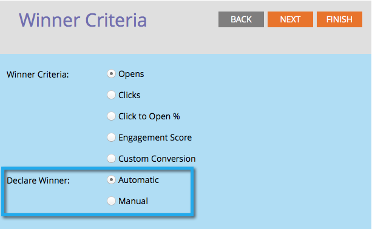

# A/Bテストの推奨結果条件の定義{#define-the-a-b-test-winner-criteria}

[電子メールプログラムにA/Bテスト](/help/marketo/product-docs/email-marketing/email-programs/email-program-actions/email-test-a-b-test/add-an-a-b-test.md)を追加する場合、テストタイプを[選択し、A/Bテスト](/help/marketo/product-docs/email-marketing/email-programs/email-program-actions/email-test-a-b-test/schedule-the-a-b-test.md)をスケジュールしてから、勝者条件を定義する必要があります。 どの電子メールの勝利を決定する方法を示します。

>[!PREREQUISITES]
>
>[A追加/Bテスト](/help/marketo/product-docs/email-marketing/email-programs/email-program-actions/email-test-a-b-test/add-an-a-b-test.md)

## 勝者条件{#winner-criteria}

1. デフォルトの&#x200B;**推奨結果条件**&#x200B;オプションが最初に表示されます。

   

   | **開く** | openは、画像が電子メールにダウンロードされると登録します。 画像を含めない場合でも、デフォルトでは、MarketorはすべてのHTML電子メールに1つのトラッキングピクセルを挿入します。 |
   |---|---|
   | **クリック数** | デフォルトでは、電子メール内のリンクにトラッキングが埋め込まれており、電子メール内のリンクは、誰がどのリンクをクリックしたか、合計クリックされた数などを確認できます。 |
   | **クリックして開く%** | 電子メール内で開かれ、リンクがクリックされた電子メールの割合。 ここでは、個別クリック数を個別オープン数で割った値を100に乗算して割合として表示することで、電子メールの関連性とコンテキストを測定します。 |
   | **エンゲージメントスコア** | [エンゲージメントスコア](/help/marketo/product-docs/email-marketing/drip-nurturing/reports-and-notifications/understanding-the-engagement-score.md)は、コンテンツの効果を判断するのに役立ちます。 |

   >[!TIP]
   >
   >「エンゲージメントスコア」を選択した場合、テストは24時間以上実行する必要があります。 [エンゲージメントスコア](/help/marketo/product-docs/email-marketing/drip-nurturing/reports-and-notifications/understanding-the-engagement-score.md)の理解についての詳細。

1. また、「カスタムコンバージョン」を選択して「編集」をクリックすると、条件をカスタマイズできます。

   

   >[!NOTE]
   >
   >カスタムコンバージョンでは、トリガーとフィルターを使用して、任意のイベントをコンバージョンとして選択できます。

1. 窓がポッと開く。 選択したトリガーを探し、キャンバスにドラッグします。

   

1. トリガーを定義します。

   

   >[!NOTE]
   >
   >Marketorは、この電子メールプログラムから電子メールを送信した人のトリガーのみを許可します。 「送信済みの電子メール」フィルターを追加する必要はありません。

1. 「**閉じる**」をクリックします。

   

   素晴らしい！ 次に、勝者の決定方法を決定する時間です。

## 推奨結果を宣言{#declare-winner}

1. 2つの使用可能なオプションのいずれかを選択します。

   

   >[!NOTE]
   >
   >**日付/時間** A/Bテストを行う場合は、**手動**&#x200B;のみ選択できます。

   A/Bテストが終了すると、マーケティング担当者は、予定された時間に勝者の電子メールを自動的に送信するか、結果を確認してどの電子メールをいつ送信するかを決定できます。

1. 「自動」はawesomeで、デフォルトのオプションです。 [**次へ**]をクリックします。

   

   >[!TIP]
   >
   >「**手動**」を選択すると、テストが送信され、推奨結果が宣言されるのを待ちます。 結果のレポートを受け取ります。

完璧！ 次に、[A/Bテスト](/help/marketo/product-docs/email-marketing/email-programs/email-program-actions/email-test-a-b-test/schedule-the-a-b-test.md)のスケジュールを設定します。
