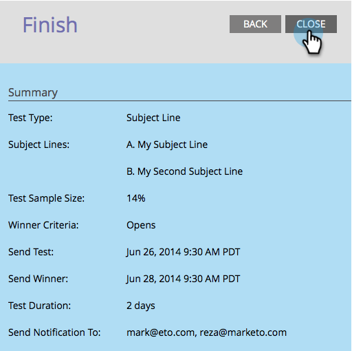

# A/Bテストのスケジュール{#schedule-the-a-b-test}

電子メールプログラムにA/Bテストを追加し、推奨結果の条件を定義したら、テストが開始されるタイミングをスケジュールする必要があります。 これが方法です。

>[!PREREQUISITES]
>
>[A追加/Bテスト](/help/marketo/product-docs/email-marketing/email-programs/email-program-actions/email-test-a-b-test/add-an-a-b-test.md)

>[!NOTE]
>
>日付/時間テストの場合は、テスト結果の概要を受け取ったときにのみ設定する必要があります。

1. **テスト**&#x200B;の送信日を選択します。

1. 「**テスト**&#x200B;を送信」の時間を選択します。

   

   >[!NOTE]
   >
   >「テストを送信」および「推奨結果を送信」は、4時間以上離れている必要があります。 ただし、送信サイズが大きい場合は、24時間待って、適切な結果が得られるまで十分な時間を待つことができます。

1. **推奨結果を送信**&#x200B;に対しても同じことを行います。 通知受信者（オプション）を入力し、「**次へ**」をクリックします。

   >[!NOTE]
   >
   >テストバリアントは、テストグループのみが受け取ります。

   

   >[!NOTE]
   >
   >勝者を手動で宣言する場合は、**メールを終了**&#x200B;日付/時刻の代わりに&#x200B;**レポート送信**&#x200B;日時を定義します。

   超！ 完了したら、概要を確認し、「Close（閉じる）」をクリックします。

   

   **スケジュール**&#x200B;タイルが更新されました。

   

   >[!NOTE]
   >
   >A/Bテストをスケジュールすると、最終送信日またはレポート送信日も設定されます。

   オーディエンスを定義済みで電子メールを選択済みの場合、残りの手順はプログラムを承認することだけです。

   >[!MORELIKETHIS]
   >
   >[電子メールプログラムの承認/未承認](/help/marketo/product-docs/email-marketing/email-programs/email-program-actions/approve-unapprove-an-email-program.md)
