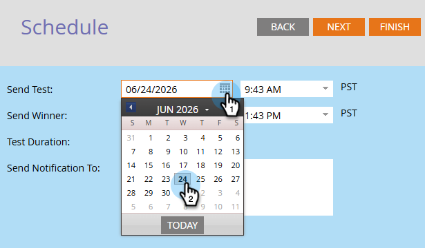
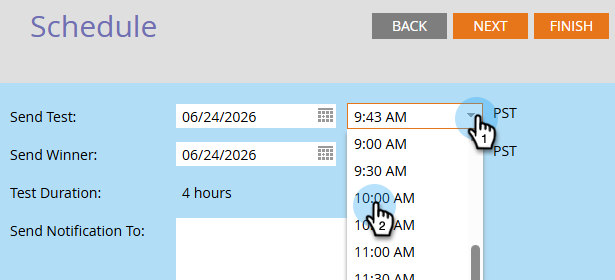
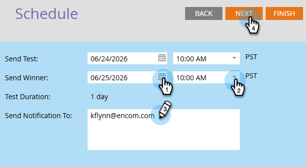
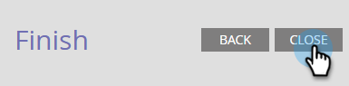
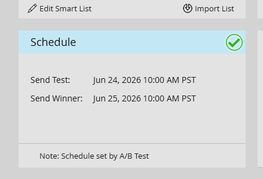

# A/B テストのスケジュール {#schedule-the-a-b-test}

メールプログラムに A/B テストを追加し、推奨結果の条件を定義したら、いつテストが開始するかをスケジュールする必要があります。 手順は以下のとおりです。

>[!PREREQUISITES]
>
>[A/B テストの追加](/help/marketo/product-docs/email-marketing/email-programs/email-program-actions/email-test-a-b-test/add-an-a-b-test.md)

>[!NOTE]
>
>日時テストの場合は、いつテスト結果の概要を受け取るかのみを設定する必要があります。

1. 「**[!UICONTROL テストを送信]**」の日付を選択します。

1. 「**[!UICONTROL テストを送信]**」の時間を選択します。

   

   >[!NOTE]
   >
   >テストの送信と勝者の送信の間には 4 時間以上置く必要があります。 ただし、送信サイズが大きい場合は、適切な結果が得られるまで十分な時間である 24 時間待つことができます。

1. 手順1と2を繰り返して、_勝者を送信_&#x200B;します。 通知受信者を入力し（オプション）、「**[!UICONTROL 次へ]**」をクリックします。

   >[!NOTE]
   >
   >テストバリアントを受け取るのは、テストグループだけです。

   

   >[!NOTE]
   >
   >勝者を手動で発表する場合は、「**レポートを送信**」日時の代わりに「**メールを送信終了**」日時を定義します。

1. 概要を確認し、**[!UICONTROL 閉じる]**&#x200B;をクリックします。

   

   **[!UICONTROL スケジュール]**&#x200B;タイルが更新されました。

   

   >[!NOTE]
   >
   >A/B テストをスケジュールすると、最終送信日またはレポート送信日も設定されます。

   オーディエンスを既に定義し、メールを選択している場合、残りの手順はプログラムを承認することだけです。

   >[!MORELIKETHIS]
   >
   >[メールプログラムの承認／承認取り消し](/help/marketo/product-docs/email-marketing/email-programs/email-program-actions/approve-unapprove-an-email-program.md)
