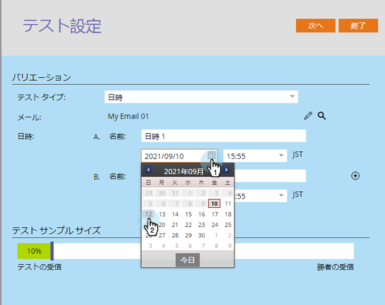

# 「日付/時刻」のA/Bテストを使用{#use-date-time-a-b-testing}

電子メールのA/Bテストは簡単に行えます。 1つは&#x200B;**日付/時刻**&#x200B;テストです。 このテストでは、電子メールを送信するのに最適な時間帯または曜日をテストします。 設定方法を次に示します。

>[!PREREQUISITES]
>
>[A追加/Bテスト](/help/marketo/product-docs/email-marketing/email-programs/email-program-actions/email-test-a-b-test/add-an-a-b-test.md)

1. 「**電子メール**」タイルの下の「**追加A/Bテスト**」をクリックします。

   

1. 新しいウィンドウが開きます。 **テストタイプ**&#x200B;に対して&#x200B;**日付/時間**&#x200B;を選択します。

   

1. 以前のテスト情報（サブジェクトテストなど）がある場合は、[**テストのリセット**]をクリックしても問題ありません。

   

1. 初回の日付/時刻を選択します。

   

1. 初回の日時を選択します。

   

1. 2回目の日付/時刻にも同じことを行います。

   

1. スライダを使用してA/Bテストに含めるオーディエンスの割合を選択し、**次へ**&#x200B;をクリックします。

   

   >[!NOTE]
   >
   >異なるバリエーションは、選択したテストサンプルサイズの同じ部分に適用されます。

   >[!CAUTION]
   >
   >**サンプルサイズを100%に設定しないことをお勧めし**&#x200B;ます。静的なリストを使用している場合は、サンプルサイズを100%に設定すると、オーディエンス内の全員に電子メールが送信され、推奨結果は誰にも送信されません。 **smart**&#x200B;リストを使用している場合、サンプルサイズを100%に設定すると、その時点&#x200B;_でオーディエンス_&#x200B;内の全員に電子メールが送信されます。 電子メールプログラムが後日再び実行されると、スマートリストに振り分けられた新しいユーザーも、オーディエンスに追加された後で電子メールを受け取ります。

   さて、我々は一歩近づいた。 次に、A/Bテストの推奨結果条件](/help/marketo/product-docs/email-marketing/email-programs/email-program-actions/email-test-a-b-test/define-the-a-b-test-winner-criteria.md)を[定義する必要があります。
