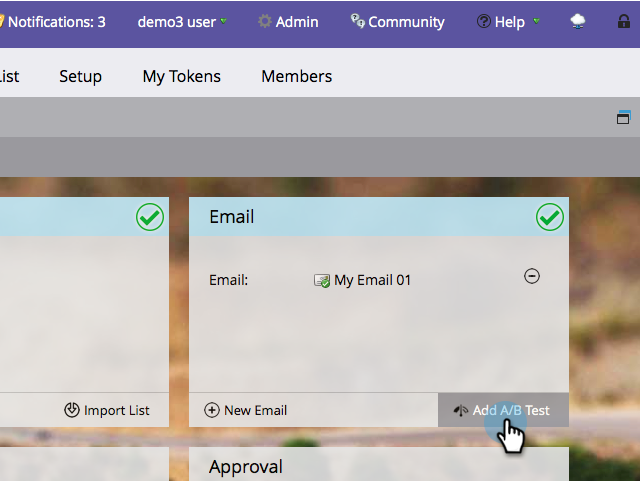
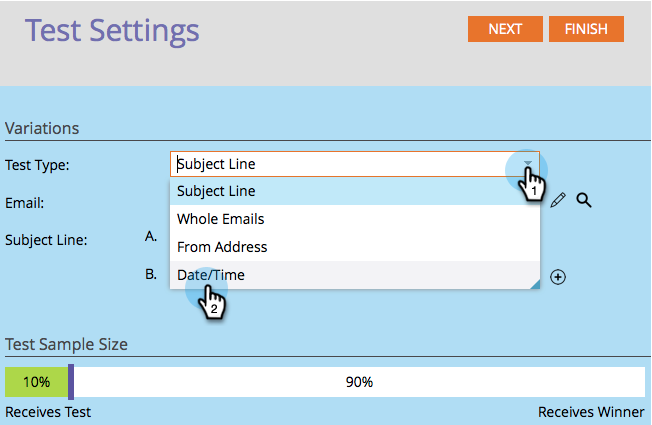
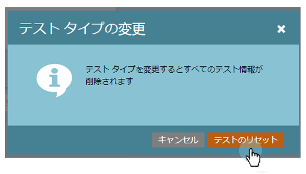
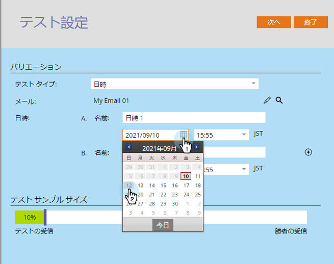
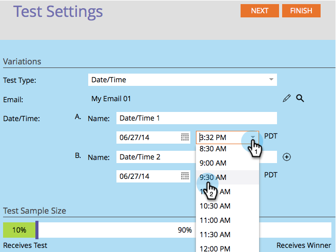
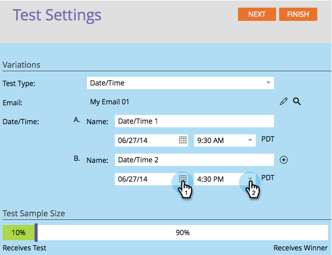

# 「日付／時間」を使った A/B テスト {#use-date-time-a-b-testing}

メールの A/B テストはとても簡単に実施できます。 1 つは&#x200B;**[!UICONTROL 日時]**&#x200B;テストです。 このテストでは、メールの送信に最適な時間帯または曜日をテストします。 その設定方法を説明しましょう。

>[!PREREQUISITES]
>
>[A/B テストの追加](/help/marketo/product-docs/email-marketing/email-programs/email-program-actions/email-test-a-b-test/add-an-a-b-test.md)
>

1. **[!UICONTROL メール]**&#x200B;タイルの下で、「**[!UICONTROL A/B テストを追加]**」をクリックします。

   

1. 新しいウィンドウが開きます。 「**[!UICONTROL テストタイプ]**」で「**[!UICONTROL 日時]**」を選択します。

   

1. 既存のテスト情報（件名テストなど）がある場合は、「**[!UICONTROL テストのリセット]**」をクリックします。

   

1. 最初の日時の日付を選択します。

   

1. 最初の日時の時刻を選択します。

   

1. 2 回目の日時にも同じ操作をおこないます。

   

1. A/B テストを送信したいオーディエンスの割合をスライダーで選択して、「**[!UICONTROL 次へ]**」をクリックします。

   

   >[!NOTE]
   >
   >それぞれのバリエーションは、選択したテストサンプルサイズを等分した割合で適用されます。

   >[!CAUTION]
   >
   >**サンプルサイズを 100% に設定しないことをお勧めします**。 静的リストを使用している場合、サンプルサイズを100%に設定すると、オーディエンス全員にメールが送信され、勝者は誰にも送信されません。 **smart** リストを使用している場合、サンプルサイズを100%に設定すると、その時点で&#x200B;_オーディエンスのすべてのユーザーにメールが送信されます。_ メールプログラムが後日再度実行されると、スマートリストの条件を満たすようになった新しい人物も、オーディエンスに含まれるためメールを受け取ります。

   ここまで来れば、あと一歩です。 続いて、[A/B テストの勝者の条件を定義](/help/marketo/product-docs/email-marketing/email-programs/email-program-actions/email-test-a-b-test/define-the-a-b-test-winner-criteria.md)する必要があります。
