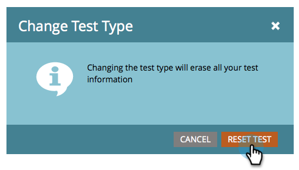
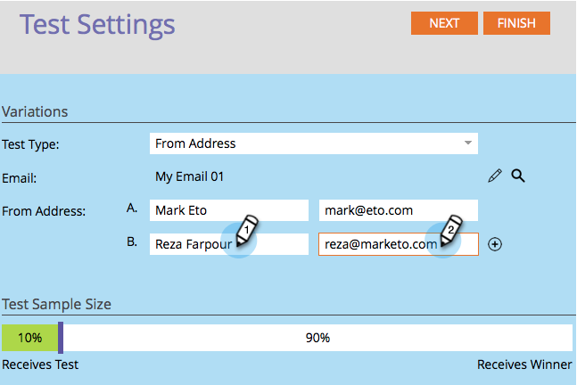

# 「[!UICONTROL 送信元アドレス]」A/B テストを使用する {#use-from-address-a-b-testing}

メールの A/B テストはとても簡単に実施できます。 なかでも興味深いのが、**[!UICONTROL 送信元アドレス]**&#x200B;テストです。 その設定方法を説明しましょう。

>[!PREREQUISITES]
>
>[A/B テストの追加](/help/marketo/product-docs/email-marketing/email-programs/email-program-actions/email-test-a-b-test/add-an-a-b-test.md)

1. 「**[!UICONTROL メール]**」タイルで、目的のメールを選択して「**[!UICONTROL A/B テストの追加]**」をクリックします。

   

1. 新しいウィンドウが開かれるので、「**[!UICONTROL テストタイプ]**」で「**[!UICONTROL 送信元アドレス]**」を選択します。

   

1. 既存のテスト情報（件名テストなど）がある場合は、「**[!UICONTROL テストのリセット]**」をクリックします。

   

1. テストする 2 つ目の&#x200B;**[!UICONTROL 送信元アドレス]**&#x200B;情報を入力します。

   >[!NOTE]
   >
   >選択 A には、選択したメールに含まれる情報が事前入力されます。

   

   >[!TIP]
   >
   >「**+**」をクリックして、送信元アドレスを必要な数だけ追加できます。

1. A/B テストを送信したいオーディエンスの割合をスライダーで選択して、「**[!UICONTROL 次へ]**」をクリックします。

   

   >[!NOTE]
   >
   >それぞれのバリエーションの割合は、選択された「テストサンプルサイズ」を等分したものとなります。

   >[!CAUTION]
   >
   >**サンプルサイズを 100% に設定しないことをお勧めします**。 静的リストを使用している場合、サンプルサイズを100%に設定すると、オーディエンス全員にメールが送信され、勝者は誰にも送信されません。 **smart** リストを使用している場合、サンプルサイズを100%に設定すると、その時点で&#x200B;_オーディエンスのすべてのユーザーにメールが送信されます。_ メールプログラムが後日再実行されると、スマートリストに振り分けられた新しいリードも、オーディエンスに含まれるようになっているのでメールを受け取ります。

   ここまで来れば、あと一歩です。 続いて、[A/B テストの勝者の条件を定義](/help/marketo/product-docs/email-marketing/email-programs/email-program-actions/email-test-a-b-test/define-the-a-b-test-winner-criteria.md)する必要があります。
