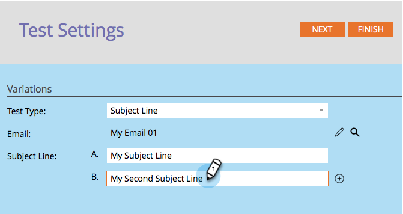

# 「件名ライン」A/B テストを使用する {#use-subject-line-a-b-testing}

メールの A/B テストはとても簡単に実施できます。 なかでも最も一般的なのが、「**[!UICONTROL 件名ライン]**」テストです。

>[!PREREQUISITES]
>
>[A/B テストの追加](/help/marketo/product-docs/email-marketing/email-programs/email-program-actions/email-test-a-b-test/add-an-a-b-test.md)

1. 「**[!UICONTROL メール]**」タイルで、目的のメールを選択して「**[!UICONTROL A/B テストの追加]**」をクリックします。

1. テストエディターウィンドウが開きます。 1 つ以上の新しい件名行を入力します。

   >[!NOTE]
   >
   >選択肢 **A** には、選択したメールに含まれる情報が事前入力されます。

   

   >[!TIP]
   >
   >「**+**」をクリックすると、件名ラインを追加できます。

1. A/B テストを送信したいオーディエンスの割合をスライダーで選択して、「**[!UICONTROL 次へ]**」をクリックします。

   

   >[!CAUTION]
   >
   >**サンプルサイズを 100% に設定しないことをお勧めします**。 静的リストを使用している場合、サンプルサイズを100%に設定すると、オーディエンス全員にメールが送信され、勝者は誰にも送信されません。 スマートリストを使用している場合、サンプルサイズを100%に設定すると、その時点で&#x200B;_オーディエンス全員にメールが送信されます。_ メールプログラムが後日再実行されると、スマートリストに振り分けられた新しいリードも、オーディエンスに含まれるようになっているのでメールを受け取ります。

   >[!NOTE]
   >
   >それぞれの件名バリエーションの割合は、ここで選択した［テストサンプルサイズ］を等分したものとなります。

   ここまで来れば、あと一歩です。 続いて、[A/B テストの勝者の条件を定義](/help/marketo/product-docs/email-marketing/email-programs/email-program-actions/email-test-a-b-test/define-the-a-b-test-winner-criteria.md)する必要があります。
