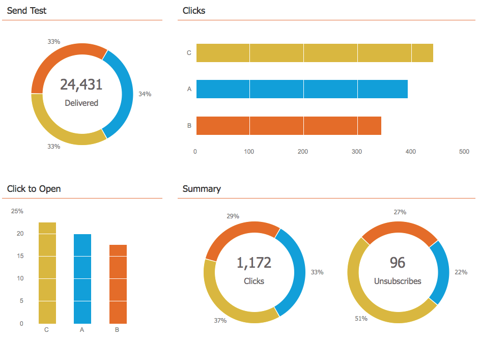
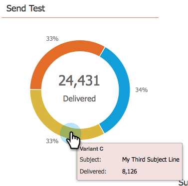

# メールプログラムのダッシュボードを使用する - A/B テストビュー {#use-the-email-program-dashboard-a-b-test-view}

ダッシュボードでは、[メールプログラムの A/B テスト](/help/marketo/product-docs/email-marketing/email-programs/email-program-actions/email-test-a-b-test/add-an-a-b-test.md)のパフォーマンスを確認できます。

## 送信テスト {#send-test}

ここでは、配信された合計とバリエーション別の分類を確認できます。

## クリック {#clicks}

ここでは、各バリエーションのクリック数を確認できます。

## クリック／開封率 {#click-to-open}

このグラフでは、開封に対するクリック率（クリック数÷開封数）を確認できます。

## 概要 {#summary}

クリックと登録解除のバリエーションごとの内訳を確認でき、容易な比較が可能です。

素敵なダッシュボードだと思いませんか。

>[!MORELIKETHIS]
>
>[メールプログラムダッシュボードの使用](/help/marketo/product-docs/email-marketing/email-programs/email-program-data/use-the-email-program-dashboard.md)>
>
