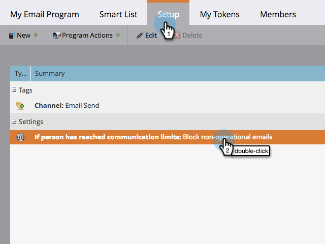

# 電子メールプログラムの通信制限を有効化/無効化{#enable-disable-communication-limits-in-an-email-program}

電子メールプログラムを実行する際、[管理レベルの通信制限](../../../../product-docs/administration/email-setup/enable-communication-limits.md) [s](../../../../product-docs/administration/email-setup/enable-communication-limits.md)を無視または適用するよう選択できます。 その方法を次に示します。

>[!NOTE]
>
>**定義**
>
>通信制限は、管理者セクション](../../../../product-docs/administration/email-setup/enable-communication-limits.md)に[設定され、1人のユーザーに過多の電子メールを送信しないようにします。

1. **マーケティングアクティビティ**&#x200B;に移動します。

   

1. 電子メールプログラムを探して選択します。

   

1. 「**セットアップ**」タブで、重複を押しながら通信制限行項目をクリックします。

   

1. デフォルトでは、通信の制限に達すると操作不可能な電子メールはブロックされますが、それらをバイパスする場合は、チェックボックスをオフにして「**保存**」をクリックします。

   

   「**操作不能な電子メール**&#x200B;をブロック」をオンにしたままにすると、管理者設定で許可されている以上の電子メールを受信したユーザーに電子メールを送信できなくなります。

