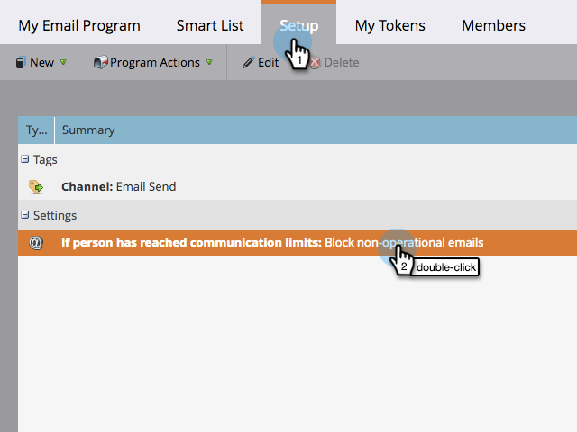

# メールプログラムの通信制限の有効化／無効化&#x200B; {#enable-disable-communication-limits-in-an-email-program}

メールプログラムを実行する際に、[管理レベルの通信制限](/help/marketo/product-docs/administration/email-setup/enable-communication-limits.md)を無視または適用するように選択できます。 その方法を説明しましょう。

>[!NOTE]
>
>通信の制限は[管理者](/help/marketo/product-docs/administration/email-setup/enable-communication-limits.md)セクションで設定され、1 人のリードに送信されるメールが多すぎないようにします。

1. **[!UICONTROL マーケティングアクティビティ]**&#x200B;に移動します。

   

1. メールプログラムを選択します。

   

1. 「**[!UICONTROL セットアップ]**」タブで、通信制限の行をダブルクリックします。

   

1. デフォルトでは、通信制限に達すると非オペレーショナルのメールをブロックする設定になっています。この設定を回避するには、チェックを外して「**[!UICONTROL 保存]**」をクリックします。

   

   「**[!UICONTROL 非オペレーショナルなメールをブロック]** 」をオンにしたままにすると、管理者の設定で許可されている数を超えるメールを受信したユーザーにメールを送信できなくなります。
