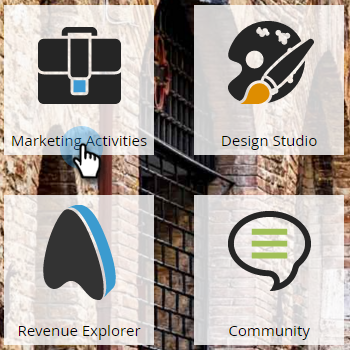
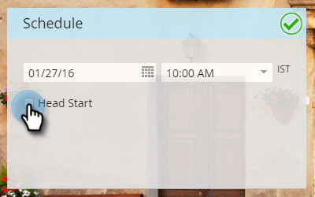
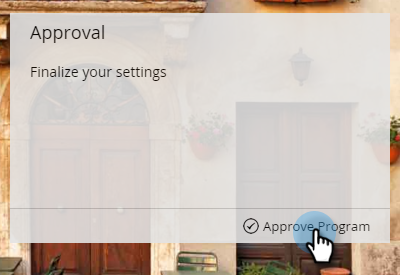
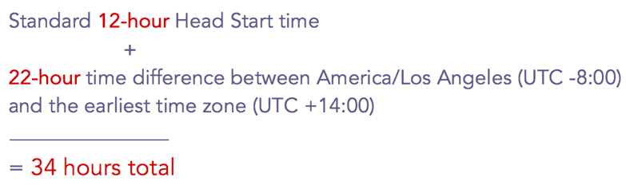

# メールプログラムの優先スタート {#head-start-for-email-programs}

>[!PREREQUISITES]
>
>[メールプログラムの作成](/help/marketo/product-docs/email-marketing/email-programs/creating-an-email-program/create-an-email-program.md)

メールプログラムの日付と時刻を選択すると、プログラムの処理を開始するタイミングが決まります。 選択した時刻にメールを送信したい場合は、ヘッドスタート機能により、プログラムを事前に処理しておくことができます。

## 標準優先スタート {#standard-head-start}

1. 「**[!UICONTROL マーケティングアクティビティ]**」をクリックします。

   

1. メールプログラムを選択します。

   

   >[!NOTE]
   >
   >ヘッドスタートは A/B テストでは使用できません。

1. [!UICONTROL スケジュール]タイルで、メールのスケジュールを設定し、「**[!UICONTROL 優先スタート]**」ボックスを選択します。

   

   [!UICONTROL 優先スタート]を選択すると、プログラムは予定時間の約 12 時間前に処理を開始します。 処理が開始されると、プログラムはロックされます。

   >[!CAUTION]
   >
   >プログラムのロック後に購読解除したオーディエンスのメンバーは、引き続きメールを受け取ります。 購読解除の通知を調整して、購読解除の処理に 1～2 営業日かかる場合があることを反映することをお勧めします。

1. 「**[!UICONTROL プログラムを承認]**」をクリックします。

   

   プログラムの承認後、承認タイルには、4 つの異なるステータスが表示されます。

   * **[!UICONTROL 実行待機中]：**&#x200B;プログラムが承認された後。
   * **[!UICONTROL 処理を開始しました。実行待機中]：**&#x200B;処理中です。
   * **[!UICONTROL 処理が完了しました。実行待機中]：**&#x200B;処理が完了しました。メールは、開始予定時間を待機中です。
   * **[!UICONTROL 終了]：**&#x200B;プログラムが完了しました。

   >[!TIP]
   >
   >プログラムがロックされた後、メールが送信される前なら、 簡単にキャンセルできます。 承認タイルの右下の「**[!UICONTROL プログラムを停止]**」をクリックするだけです。

   >[!NOTE]
   >
   >スケジュールされた実行時間の 12 時間前より後にメールプログラムの承認を取り消し、その後変更した場合は、承認の 12 時間以上後の新しい日時を選択する必要があります。

## 受信者タイムゾーンで優先スタート {#head-start-with-recipient-time-zone}

既存のヘッドスタート機能を使用するには、プログラムを少なくとも 12 時間前までにスケジュールしておく必要があります。 では、これは受信者タイムゾーンにとってどういう意味になるのでしょうか。 受信者のタイムゾーンがアクティブな場合、最も早いタイムゾーン（UTC +14:00）の真夜中にメールプログラムの実行を開始します。 したがって、**両方**&#x200B;の先頭タイムゾーンと受信者タイムゾーンを有効にするには、プログラムを最も早いタイムゾーン（UTC +14:00 **）よりも少なくとも12時間早く** スケジュールする必要があります。

つまり、米国/ロサンゼルス在住で、ヘッドスタートと受信者タイムゾーンの両方を有効にする場合は、プログラムを&#x200B;**34時間**&#x200B;事前にスケジュールする必要があります。 どうやってこの数字にたどり着いたのでしょうか。

受信者タイムゾーンを使用したメールプログラムのスケジュール方法についての[詳細](/help/marketo/product-docs/email-marketing/email-programs/email-program-actions/scheduling-with-recipient-time-zone/schedule-email-programs-with-recipient-time-zone.md)をご覧ください。

>[!MORELIKETHIS]
>
>* [メールプログラムのスケジュール設定](/help/marketo/product-docs/email-marketing/email-programs/email-program-actions/schedule-your-email-program.md)
>* [受信者タイムゾーンを使用したメールプログラムのスケジュール設定](/help/marketo/product-docs/email-marketing/email-programs/email-program-actions/scheduling-with-recipient-time-zone/schedule-email-programs-with-recipient-time-zone.md)
>* [受信者タイムゾーンについて](/help/marketo/product-docs/email-marketing/email-programs/email-program-actions/scheduling-with-recipient-time-zone/understanding-recipient-time-zone.md)
