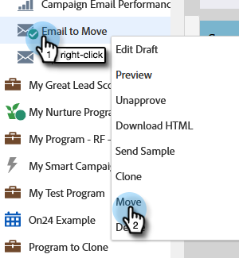

# メールの移動 {#move-an-email}

プログラム間でメールを移動したい場合は、手順は次のとおりです。

1. **[!UICONTROL マーケティングアクティビティ]**&#x200B;に移動します。

   

1. 移動するメールを見つけ、右クリックして「**[!UICONTROL 移動]**」を選択します。

   

1. **[!UICONTROL 宛先]**／**[!UICONTROL プログラム]**&#x200B;とオプションの「**[!UICONTROL フォルダー]**」を選択します。「**[!UICONTROL 移動]**」を選択します。

   

   >[!NOTE]
   >
   >この例では、別のプログラムにメールを移動しますが、[!UICONTROL デザインスタジオ]のフォルダーにメールを移動することもできます。

   メールが他のプログラムに保存されます。

   

   >[!NOTE]
   >
   >また、メールをツリー内の新しい宛先にドラッグ＆ドロップするだけでもかまいません。
