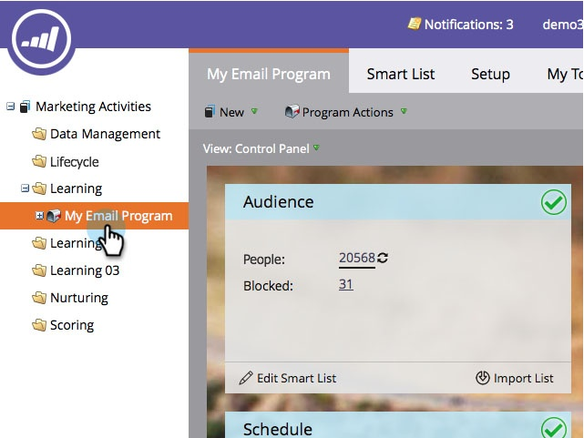
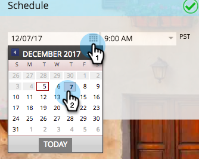
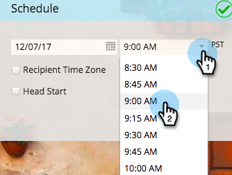
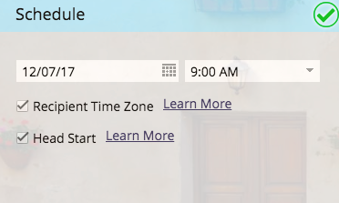

# メールプログラムのスケジュールを設定する {#schedule-your-email-program}

>[!PREREQUISITES]
>
>* [メールプログラムの作成](/help/marketo/product-docs/email-marketing/email-programs/creating-an-email-program/create-an-email-program.md)
>* [スマートリストを使用してオーディエンスを定義する](/help/marketo/product-docs/email-marketing/email-programs/managing-people-in-email-programs/define-an-audience-with-a-smart-list.md)または[リストをインポートしてオーディエンスを定義する](/help/marketo/product-docs/email-marketing/email-programs/managing-people-in-email-programs/define-an-audience-by-importing-a-list.md)
>
>* [既存のメールを選択する](/help/marketo/product-docs/email-marketing/email-programs/email-program-actions/choose-an-existing-email.md)または[新規メールを作成する](/help/marketo/product-docs/email-marketing/email-programs/email-program-actions/create-an-email-for-an-email-program.md)

メールプログラムを作成してオーディエンスを定義し、メールを選択したら、プログラムに&#x200B;*いつ*&#x200B;メールを送信するかを伝える必要があります。 手順は以下のとおりです。

1. **[!UICONTROL マーケティングアクティビティ]**&#x200B;に移動します。

   

1. メールプログラムを選択します。

   

1. 「**[!UICONTROL スケジュール]**」タイルで、日付を設定します。

   

1. さらに時間を設定します。

   

1. [[!UICONTROL 受信者タイムゾーン]](/help/marketo/product-docs/email-marketing/email-programs/email-program-actions/scheduling-with-recipient-time-zone/schedule-email-programs-with-recipient-time-zone.md)機能や[[!UICONTROL ヘッドスタート]](/help/marketo/product-docs/email-marketing/email-programs/email-program-actions/head-start-for-email-programs.md)機能を使用することもできます。

   

   簡単ですね。 残っているのは[ メールプログラムの承認](/help/marketo/product-docs/email-marketing/email-programs/email-program-actions/approve-unapprove-an-email-program.md)のみです。よろしくお願いします。

>[!MORELIKETHIS]
>
>* [受信者タイムゾーンを使用したメールプログラムのスケジュール設定](/help/marketo/product-docs/email-marketing/email-programs/email-program-actions/scheduling-with-recipient-time-zone/schedule-email-programs-with-recipient-time-zone.md)
>* [メールプログラムのヘッドスタート](/help/marketo/product-docs/email-marketing/email-programs/email-program-actions/head-start-for-email-programs.md)
