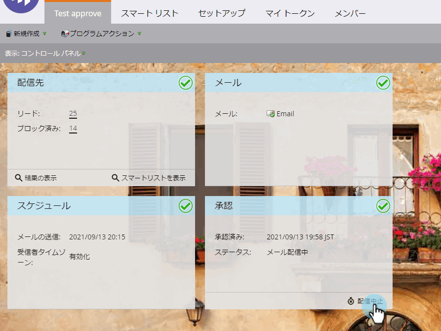

# 受信者のタイムゾーンでスケジュールされた電子メールプログラムの配信を中止 {#abort-delivery-of-email-programs-scheduled-with-recipient-time-zone}

緊急の場合は、受信者のタイムゾーンを有効にして実行を開始した電子メールプログラムの配信を中止できます。

受信者タイムゾーンでスケジュールされた電子メールプログラムは、24時間まで実行できるので、プログラムの配信を中止すると、その時点以降の送信はキャンセルされます。

1. キャンセルする電子メールプログラムを選択し、コントロールパネルの「配信」タイルの **下にある「承認を中止** 」をクリックします。

   

1. 「 **中止**」をクリックして、配信をキャンセルすることを確認します。

   

1. キャンセル後、電子メールプログラムの **結果** (Results)グリッドは下の図のように表示されます。 それ以降の送信はキャンセルされ、 **アクティビティタイプ** 列に「電子メールのバウンスソフト」と表示されます。

   

   >[!NOTE]
   >
   >キャンセルした電子メール **は** 、最初にそれぞれのタイムゾーンで配信される予定だった時刻 ** まで、ソフトバウンスとして表示されません。 それまでは、「電子メールの送信」と表示され続けます。

1. グリッドから任意の電子メールをクリックして、表示アクティビティの詳細を表示できます。 キャンセルされた送信の場合、詳細ポップアップは次のようになります。

   

>[!MORELIKETHIS]
>
>* [受信者のタイムゾーンについて](understanding-recipient-time-zone.md)
>* [受信者のタイムゾーンでの電子メールプログラムのスケジュール](schedule-email-programs-with-recipient-time-zone.md)

>

