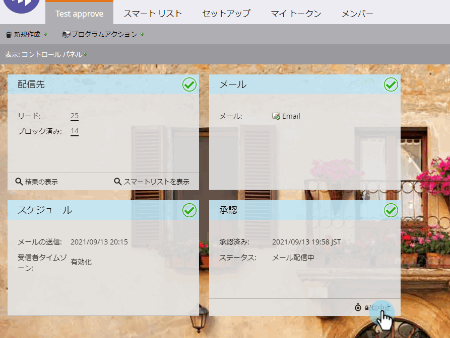
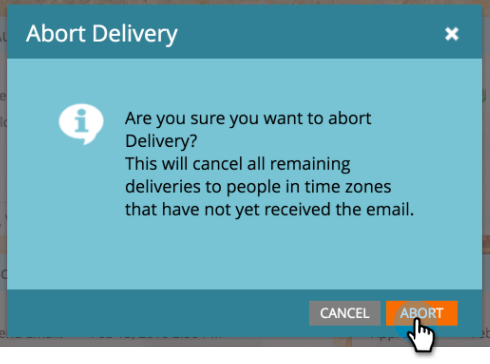
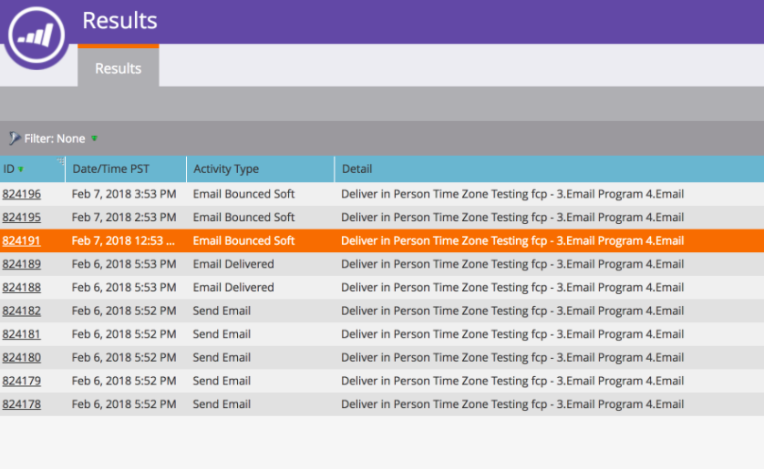
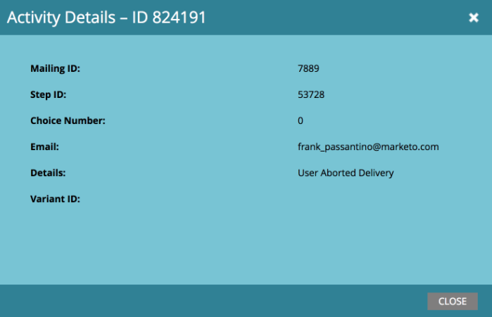

# 受信者タイムゾーンを使用してスケジュールされたメールプログラムの配信を中止する {#abort-delivery-of-email-programs-scheduled-with-recipient-time-zone}

万一の場合には、「受信者タイムゾーン」が有効化された状態ですでに起動しているメールプログラムの配信を中止することができます。

受信者タイムゾーンでスケジュールされたメールプログラムは、最大24時間実行できるため、プログラムの配信を中止すると、その後の送信がキャンセルされます。

1. キャンセルするメールプログラムを選択し、コントロールパネルの[!UICONTROL 承認] タイルの下にある&#x200B;**[!UICONTROL 配信を中止]**&#x200B;をクリックします。

   

1. 「**[!UICONTROL 中止]**」をクリックして、配信のキャンセルを確認します。

   

1. 配信がキャンセルされると、メールプログラムの「**[!UICONTROL 実行結果]**」グリッドは以下のように表示されます。 後続のメール送信はすべてキャンセルされて、**[!UICONTROL アクティビティタイプ]**&#x200B;列で「ソフトバウンスメール」と表示されます。

   

   >[!NOTE]
   >
   >キャンされたメールは、個々のタイムゾーンでの元の配信予定時間になる&#x200B;*までは*、「ソフトバウンス」として表示され&#x200B;**ません**。 その時間までは「送信済みメール」として表示されます。

1. グリッドからメールをクリックすると、アクティビティの詳細を確認できます。 キャンセルされた送信の場合、詳細ポップアップは次のようになります。

   

>[!MORELIKETHIS]
>
>* [受信者タイムゾーンについて](/help/marketo/product-docs/email-marketing/email-programs/email-program-actions/scheduling-with-recipient-time-zone/understanding-recipient-time-zone.md)
>* [受信者タイムゾーンを使用したメールプログラムのスケジュール設定](/help/marketo/product-docs/email-marketing/email-programs/email-program-actions/scheduling-with-recipient-time-zone/schedule-email-programs-with-recipient-time-zone.md)
