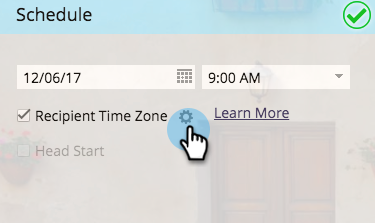
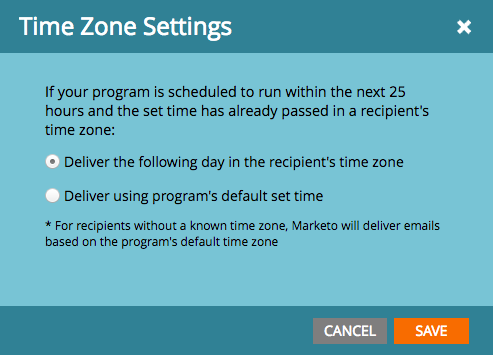
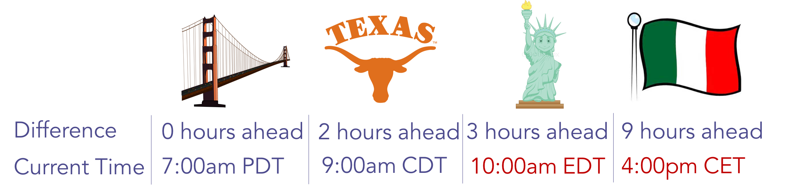
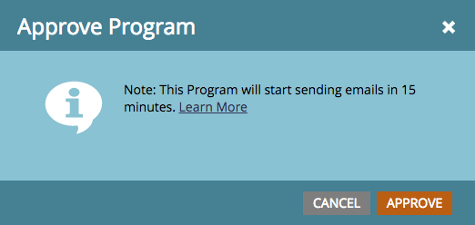
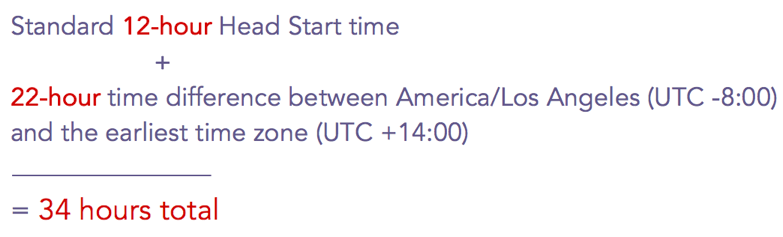

# 受信者タイムゾーンでメールプログラムをスケジュールする {#schedule-email-programs-with-recipient-time-zone}

受信者タイムゾーンが有効になっている間にメールプログラムをスケジュールする場合は、次の2つのシナリオが考えられます。

1. 次の 25 時間&#x200B;**以内**&#x200B;に実行するようにプログラムをスケジュールする
1. プログラムを実行するスケジュールは、25時間前（つまり、来週）よりも&#x200B;**多く**&#x200B;です

## シナリオ 1：25 時間以内 {#scenario-within-hours}

受信者タイムゾーンが有効になっていて、25 時間以内に予定されている配信時間がメールプログラムで承認されたとします。 スマートリストに、予定時間が過ぎたタイムゾーンに住むユーザーがいる可能性があります。

このシナリオでは、資格を持つユーザーのこのサブセットで何をおこなうかを決定できます。 メールプログラムの&#x200B;**[!UICONTROL スケジュール]**&#x200B;タイルで、「**[!UICONTROL 受信者タイムゾーン]**」の横の歯車アイコンをクリックします。

これにより、次の 2 つのオプションを使用できます。

>[!NOTE]
>
>**定義**
>
>* **[!UICONTROL 受信者のタイムゾーンで次の日を配信]**：メールが火曜日の9:00amに送信される予定の場合、スケジュールされた時間が既に経過しているタイムゾーンに住む適格なユーザーは、*水曜日*&#x200B;の9:00amにメールを受信します。
>
>* **[!UICONTROL プログラムのデフォルト設定時間を使用して配信]**：メールが火曜日の 9:00am に送信されるようにスケジュールされている場合、スケジュールされた時間が過ぎたタイムゾーンに住む該当ユーザは&#x200B;*サブスクリプションのタイムゾーン設定に基づいて*&#x200B;メールを受信します。 つまり、[サブスクリプションのタイムゾーン設定](/help/marketo/product-docs/administration/settings/change-time-zone.md)が PDT 米国ロスアンゼルスに設定されている場合、これらの受信者は、引き続き火曜日の 9:00am PDT（各自のタイムゾーンの時間）にメールを受け取ります。

>[!NOTE]
>
>Marketo が受信者タイムゾーンを計算する方法についての[詳細](/help/marketo/product-docs/email-marketing/email-programs/email-program-actions/scheduling-with-recipient-time-zone/understanding-recipient-time-zone.md#calculating-time-zone)をご覧ください。

このシナリオについて詳しく見てみましょう。 例えば、サンフランシスコに在住で、**9:00am**&#x200B;件の送信を7:00amに電子メールでスケジュールしているとします。 スマートリストには、次の地域のユーザーが含まれています。

* サンフランシスコ
* テキサス
* ニューヨーク
* イタリア

9:00amは既にニューヨークとイタリアを通過しているため、これら2つのタイムゾーンの適格なユーザーは&#x200B;**タイムゾーン設定**&#x200B;に基づいてメールを受け取ります。

* **[!UICONTROL 受信者のタイムゾーン ]:**&#x200B;水曜日、それぞれのタイムゾーンの9:00amに次の日を配信します。**OR**

* **[!UICONTROL プログラムのデフォルト設定時間を使用して配信]**：火曜日の 9:00am PDT（ニューヨーク - 12:00pm EDT、イタリア - 6:00pm CET）。

プログラムを承認すると、15 分以内に実行が開始されます。

>[!NOTE]
>
>プログラムはメール送信の&#x200B;*プロセス*&#x200B;を15分で開始しますが、その時点ではメールは&#x200B;*配信*&#x200B;されません。 選択する&#x200B;**[!UICONTROL タイムゾーン設定]**&#x200B;に基づいて受信者がメールを受信します。

## シナリオ 2：25 時間以上 {#scenario-more-than-hours}

この 2 番目のシナリオでは、**[!UICONTROL 受信者タイムゾーン]**&#x200B;が有効で、配信予定時刻が 25 時間以上先のメールプログラムを承認します。 この場合、プログラムは、世界の&#x200B;**最も早い** タイムゾーン （UTC + 14:00）のスケジュールされた時間に実行を開始します。 スマートリストの対象の適格ユーザーは世界中のあらゆるタイムゾーンにいる場合があるので、最も早いタイムゾーンから、それぞれのタイムゾーンにいるすべての受信者に予定された日時にメールを配信できます。

**優先スタート**

次に、[[!UICONTROL 優先スタート]](/help/marketo/product-docs/email-marketing/email-programs/email-program-actions/head-start-for-email-programs.md)が&#x200B;**[!UICONTROL 受信者タイムゾーン]**&#x200B;とどのように連携するのかを説明します。 既存の優先スタート機能を使用するには、プログラムが少なくとも 12 時間前にスケジュールされている必要があります。 受信者タイムゾーンとはどういう意味でしょうか？ 受信者タイムゾーンを有効にすると、最も早いタイムゾーン（UTC +14:00）の予定時刻にメールプログラムの実行が開始されます。 したがって、優先スタートと受信者の&#x200B;**両方**&#x200B;のタイムゾーンを有効にするには、メールプログラムを **UTC +14:00 のスケジュール時刻より少なくとも 12 時間早く**&#x200B;スケジュールする必要があります。

つまり、米国/ロサンゼルス在住で、ヘッドスタートと受信者タイムゾーンの両方を有効にする場合は、プログラムを&#x200B;**34時間**&#x200B;事前にスケジュールする必要があります。 どうやってこの数字にたどり着いたのでしょうか。

  

つまり、受信者のタイムゾーンでスケジュールされたメールプログラムは、各タイムゾーンに対応するために、最も早いタイムゾーン（つまり、最初に午前0時に達するタイムゾーン）でスケジュールされた時間に実行を開始する必要があります。 メールプログラムをスケジュールする場合…

* **配信時刻を **25 時間以内**&#x200B;に設定すると、15 分以内にプログラムの実行が開始されます。 スケジュールされた時間を既に通過した受信者は、選択したタイムゾーン設定に基づいて電子メールを受信します。
* **配信時刻を 25 時間後&#x200B;*以降***&#x200B;に設定すると、プログラムは最も早いタイムゾーン（UTC +14:00）で予定時に実行を開始します。
* **優先スタート**&#x200B;に設定されている場合、最も早いタイムゾーン（UTC +14:00）で予定時間の 12 時間前に処理を開始します。

>[!CAUTION]
>
>メール送信を開始してから実際に配信されるまでの間に購読を解除したユーザーは、引き続きメールを受け取ります。 登録解除の処理に1～2営業日かかる場合があることを説明するために、登録解除の通知を調整することをお勧めします。

>[!MORELIKETHIS]
>
>* [受信者タイムゾーンについて](/help/marketo/product-docs/email-marketing/email-programs/email-program-actions/scheduling-with-recipient-time-zone/understanding-recipient-time-zone.md)
>* [メールプログラムのヘッドスタート](/help/marketo/product-docs/email-marketing/email-programs/email-program-actions/head-start-for-email-programs.md)
>* [受信者タイムゾーンを使用してスケジュールされたメールプログラムの配信の中止](/help/marketo/product-docs/email-marketing/email-programs/email-program-actions/scheduling-with-recipient-time-zone/abort-delivery-of-email-programs-scheduled-with-recipient-time-zone.md)
