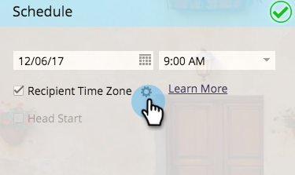
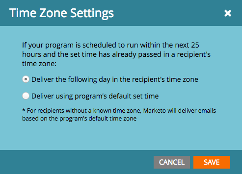
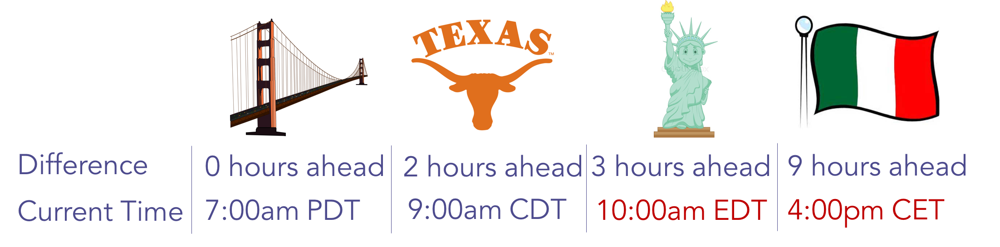
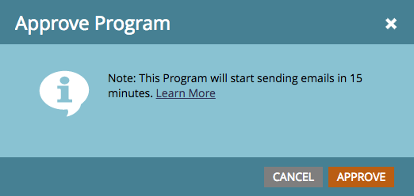

# 受信者タイムゾーンでメールプログラムをスケジュール {#schedule-email-programs-with-recipient-time-zone}

受信者タイムゾーンが有効になっている間にメールプログラムをスケジュールする場合は、次の2つのシナリオが考えられます。

1. 次の 25 時間&#x200B;**以内**&#x200B;に実行するようにプログラムをスケジュールする
1. プログラムを実行するスケジュールは、25時間前（つまり、来週）よりも&#x200B;**多く**&#x200B;です

## シナリオ 1：25 時間以内 {#scenario-within-hours}

受信者タイムゾーンを有効にしたメールプログラムを承認し、今後 25 時間以内の配信時間をスケジュールしたとします。 スマートリストに、予定時間が過ぎたタイムゾーンに住むユーザーがいる可能性があります。

このシナリオでは、資格を持つユーザーのこのサブセットで何をおこなうかを決定できます。 メールプログラムの&#x200B;**[!UICONTROL スケジュール]**&#x200B;タイルで、「**[!UICONTROL 受信者タイムゾーン]**」の横の歯車アイコンをクリックします。

これにより、次の 2 つのオプションを使用できます。

>[!NOTE]
>
>**定義**
>
>* **[!UICONTROL 受信者のタイムゾーンで次の日を配信]**：メールが火曜日の午前9時に送信される予定の場合、スケジュールされた時間が既に経過しているタイムゾーンに住む適格なユーザーは、午前9時に&#x200B;*水曜日*&#x200B;にメールを受信します。
>
>* **[!UICONTROL プログラムのデフォルトの設定時間を使用して配信]**：メールが火曜日の午前9時に送信される予定の場合、スケジュール時間が既に経過しているタイムゾーンに住む適格なユーザーは、サブスクリプションのタイムゾーン設定&#x200B;*に基づいてメール*&#x200B;を受け取ります。 したがって、[ サブスクリプションのタイムゾーン設定](/help/marketo/product-docs/administration/settings/change-time-zone.md)がPDT America/Los Angelesに設定されている場合、これらの受信者は火曜日の午前9:00にPDT （自分のタイムゾーンに関係なく）に電子メールを受け取ります。

>[!NOTE]
>
>Marketo が受信者タイムゾーンを計算する方法についての[詳細](/help/marketo/product-docs/email-marketing/email-programs/email-program-actions/scheduling-with-recipient-time-zone/understanding-recipient-time-zone.md#calculating-time-zone)をご覧ください。

このシナリオについて詳しく見てみましょう。 例えば、サンフランシスコに住んでいて、**9:00am**&#x200B;の送信のために午前7:00にメールをスケジュールしているとします。 スマートリストには、次の地域のユーザーが含まれています。

* サンフランシスコ
* テキサス
* ニューヨーク
* イタリア

ニューヨークとイタリアでは午前9時を過ぎているので、これら2つのタイムゾーンの適格なユーザーは、**タイムゾーン設定**&#x200B;に基づいて電子メールを受信します。

* **[!UICONTROL 受信者のタイムゾーンで次の日を配信]:**&#x200B;水曜日の午前9:00に、それぞれのタイムゾーンで&#x200B;**OR**&#x200B;を配信します

* **[!UICONTROL プログラムのデフォルトの設定時間を使用して配信する]**：火曜日の午前9:00 PDT （ニューヨーク - 12:00 pm EDT、イタリア - 6:00 pm CET）。

プログラムを承認すると、15 分以内に実行が開始されます。

>[!NOTE]
>
>プログラムはメール送信の&#x200B;*プロセス*&#x200B;を15分で開始しますが、その時点ではメールは&#x200B;*配信*&#x200B;されません。 選択する&#x200B;**[!UICONTROL タイムゾーン設定]**&#x200B;に基づいて受信者がメールを受信します。

## シナリオ 2：25 時間以上 {#scenario-more-than-hours}

この 2 番目のシナリオでは、**[!UICONTROL 受信者タイムゾーン]**&#x200B;が有効で、配信予定時刻が 25 時間以上先のメールプログラムを承認します。 この場合、プログラムは、世界の&#x200B;**最も早い** タイムゾーン （UTC + 14:00）のスケジュールされた時間に実行を開始します。 スマートリストの対象の適格ユーザーは世界中のあらゆるタイムゾーンにいる場合があるので、最も早いタイムゾーンから、それぞれのタイムゾーンにいるすべての受信者に予定された日時にメールを配信できます。

**優先スタート**

次に、[[!UICONTROL 優先スタート]](/help/marketo/product-docs/email-marketing/email-programs/email-program-actions/head-start-for-email-programs.md)が&#x200B;**[!UICONTROL 受信者タイムゾーン]**&#x200B;とどのように連携するのかを説明します。 既存の優先スタート機能を使用するには、プログラムが少なくとも 12 時間前にスケジュールされている必要があります。 受信者タイムゾーンとはどういう意味でしょうか？ 受信者のタイムゾーンが有効になっている場合は、最も早いタイムゾーン（UTC +14:00）のスケジュールされた時間にメールプログラムの実行を開始します。 したがって、**両方の**&#x200B;の先頭と受信者のタイムゾーンを有効にするには、電子メールプログラムを&#x200B;**UTC +14:00のスケジュール時間より少なくとも12時間前にスケジュールする必要があります。**

つまり、米国/ロサンゼルス在住で、ヘッドスタートと受信者タイムゾーンの両方を有効にする場合は、プログラムを&#x200B;**34時間**&#x200B;事前にスケジュールする必要があります。 どうやってこの数字にたどり着いたのでしょうか。

  

つまり、受信者のタイムゾーンでスケジュールされたメールプログラムは、各タイムゾーンに対応するために、最も早いタイムゾーン（つまり、最初に午前0時に達するタイムゾーン）でスケジュールされた時間に実行を開始する必要があります。 メールプログラムをスケジュールする場合…

* **配信時刻を **25 時間以内**&#x200B;に設定すると、15 分以内にプログラムの実行が開始されます。 スケジュールされた時間を既に通過した受信者は、選択したタイムゾーン設定に基づいて電子メールを受信します。
* **配信時間が&#x200B;*25時間以上***&#x200B;の場合、プログラムは最も早いタイムゾーン （UTC +14:00）のスケジュールされた時間に実行を開始します。
* **Head Start**&#x200B;を使用すると、プログラムは、スケジュールされた時刻の12時間前の最も早いタイムゾーン （UTC +14:00）で処理を開始します。

>[!CAUTION]
>
>メール送信を開始してから実際に配信されるまでの間に購読を解除したユーザーは、引き続きメールを受け取ります。 登録解除の処理に1～2営業日かかる場合があることを説明するために、登録解除の通知を調整することをお勧めします。

>[!MORELIKETHIS]
>
>* [受信者タイムゾーンについて](/help/marketo/product-docs/email-marketing/email-programs/email-program-actions/scheduling-with-recipient-time-zone/understanding-recipient-time-zone.md)
>* [メールプログラムのヘッドスタート](/help/marketo/product-docs/email-marketing/email-programs/email-program-actions/head-start-for-email-programs.md)
>* [受信者タイムゾーンを使用してスケジュールされたメールプログラムの配信の中止](/help/marketo/product-docs/email-marketing/email-programs/email-program-actions/scheduling-with-recipient-time-zone/abort-delivery-of-email-programs-scheduled-with-recipient-time-zone.md)
