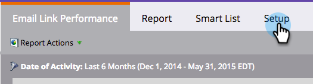
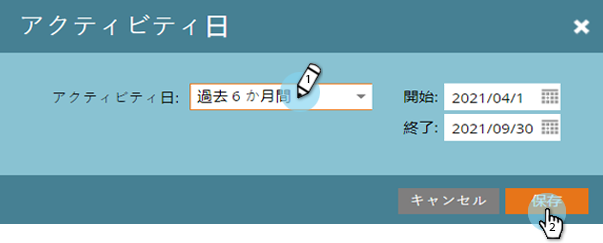
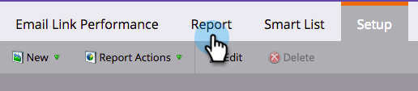
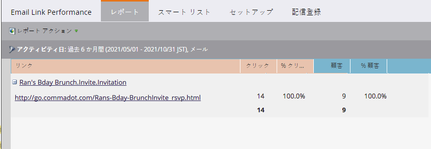

# 電子メールリンクパフォーマンスレポート{#email-link-performance-report}

電子メールリンクのパフォーマンスレポートを作成して、電子メール内のリンクのパフォーマンスを確認します。

1. [プ](/help/marketo/product-docs/reporting/basic-reporting/creating-reports/create-a-report-in-a-program.md) ログラムでレポートを作成し、レポートタイプとして「 **電子メールリンク** のパフォーマンス」を選択します。

   

1. 「**セットアップ**」をクリックします。

   

1. **設定**&#x200B;の下の&#x200B;**アクティビティ**&#x200B;の日付を重複クリックします。

   

1. レポートに適切な期間を設定します。 「**保存**」をクリックします。

   

1. 「**レポート**」をクリックします。

   

1. 素晴らしい！ これで、電子メールリンクのパフォーマンスレポートが作成されました。

   

[電子メールリンクのパフォーマンスレポート](/help/marketo/product-docs/reporting/basic-reporting/editing-reports/select-report-columns.md) に使用できる列は次のとおりです。

<table> 
 <thead> 
  <tr> 
   <th colspan="1" rowspan="1">列</th> 
   <th colspan="1" rowspan="1">説明</th> 
  </tr> 
 </thead> 
 <tbody> 
  <tr> 
   <td colspan="1" rowspan="1">リンク</td> 
   <td colspan="1" rowspan="1">電子メール名でグループ化。 プラス(+)をクリックすると、その電子メールに含まれているすべてのリンクが表示されます。</td> 
  </tr> 
  <tr> 
   <td colspan="1" rowspan="1">クリック数</td> 
   <td colspan="1" rowspan="1">そのリンクがクリックされた回数。</td> 
  </tr> 
  <tr> 
   <td colspan="1" rowspan="1">%クリック数</td> 
   <td colspan="1" rowspan="1">その電子メール内のすべてのリンクの合計クリック数のうち、このリンクの割合。</td> 
  </tr> 
  <tr> 
   <td colspan="1" rowspan="1">ユーザー</td> 
   <td colspan="1" rowspan="1">リンクをクリックした純人数。</td> 
  </tr> 
  <tr> 
   <td colspan="1" rowspan="1">%人</td> 
   <td colspan="1" rowspan="1">その電子メール内のリンクをクリックした個別訪問者数の合計（割合）。</td> 
  </tr> 
 </tbody> 
</table>

>[!TIP]
>
>個人が何をしたかを正確に知りたい場合は、プログラムの「アクティビティ」タブから、[個人の詳細](/help/marketo/product-docs/core-marketo-concepts/smart-lists-and-static-lists/managing-people-in-smart-lists/using-the-person-detail-page.md)ページの[メンバーログ](/help/marketo/product-docs/core-marketo-concepts/smart-lists-and-static-lists/managing-people-in-smart-lists/filter-activity-types-in-the-activity-log-of-a-person.md)を開きます。

>[!MORELIKETHIS]
>
>* [電子メールパフォーマンスレポート](/help/marketo/product-docs/email-marketing/email-programs/email-program-data/email-performance-report.md)
>* [電子メールレポートでのアセットのフィルタリング](/help/marketo/product-docs/reporting/basic-reporting/report-activity/filter-assets-in-an-email-report.md)

