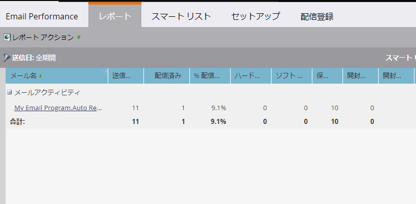

# 電子メールパフォーマンスレポート{#email-performance-report}

配信、開封、クリックなどの統計に関する電子メールのパフォーマンスを確認するには、電子メールのパフォーマンスレポートを作成します。

1. [プ](/help/marketo/product-docs/reporting/basic-reporting/creating-reports/create-a-report-in-a-program.md) ログラムでレポートを作成し、「 **電子メール** [パフォーマンスレポートタイプ](/help/marketo/product-docs/reporting/basic-reporting/report-types/report-type-overview.md)」を選択します。
1. [レポート時間](/help/marketo/product-docs/reporting/basic-reporting/editing-reports/change-a-report-time-frame.md) 枠を変更し、「レポート」 **** タブをクリックします。
1. そこだ！ 次に、レポートを調べて、電子メールのパフォーマンスを確認します。

   >[!NOTE]
   >
   >送信日フィルターは、電子メールが最初に送信された日付に基づきます。

   

   >[!TIP]
   >
   >電子メールの名前をクリックして、電子メールプレビューで開きます。

   >[!NOTE]
   >
   >電子メールのパフォーマンスレポートには、電子メールの送信後に削除されたユーザーを含む、すべてのユーザーのアクティビティが含まれます。 場合によっては、アクティブなユーザーのアクティビティのみを表示したい場合があります。 その場合は、削除したユーザーをレポートから除外する必要があります。 **スマートリスト**&#x200B;タブを使用して、[レポート用のスマートリスト](/help/marketo/product-docs/core-marketo-concepts/smart-lists-and-static-lists/creating-a-smart-list/create-a-smart-list.md)を作成します。 特定のフィールドに対してフィルタを適用しない場合は、電子メールアドレスフィルタを次のように設定します。**が空ではありません**。

   [電子メールパフォーマンスレポートのレポート](/help/marketo/product-docs/reporting/basic-reporting/editing-reports/select-report-columns.md) 列を選択します。次に例を示します。

   | 列 | 説明 |
   |---|---|
   | ハードバウンス | 電子メールアドレスが存在しないなどの恒久的な条件が原因で、電子メールが拒否されました。 |
   | ソフトバウンス | サーバーがダウンしているか、受信トレイがいっぱいであるなど、一時的な状態が原因で電子メールが拒否されました。 |
   | 保留中 | この数は、送信された電子メールの合計数から、配信済み、バウンス済み、ソフトバウンスの各電子メールの数を引いて計算されます。 |
   | クリックされたリンク | 電子メール内のリンクをクリックした電子メール受信者の数。 |
   | 登録解除 | 電子メール内の&#x200B;**購読解除**&#x200B;リンクをクリックし、フォームに入力した電子メール受信者の数です。 |

   >[!NOTE]
   >
   >登録を解除したリンクと電子メールアドレスが電子メールでクリックされても、レポートの「クリックされたリンク」に登録されません。

一般的に、私たちは常識を使って統計を記録しようとします。 例えば、電子メール内のリンクをクリックした訪問者は、明らかに最初に電子メールを開いています。 電子メールパフォーマンスレポートでは、次の特定のルールに従います。

* **ルール1**:各電子メールアクティビティレコードは、次のうち1つ（1つのみ）に設定されます。 _配信済み_、 _ハードバウンス_、 _ソフトバウンス_、 _保留_。

* **規則2**:電子メールレコードに「 *開封済み*」と表示されている場合は *、「*&#x200B;配信済み」とカウントされます。

* **規則3**:電子メールレコードに _「_ クリックされた電子メール _」または「登録解除_&#x200B;済み __ 」と表示される場合は、「配信済みで _開いています_」とカウントされます。

* **規則4**:電子メールが「 _開く_」の場合、バウンスは無視されます。電子メールが開かれていない場合は、_ハードバウンス_&#x200B;が&#x200B;_ソフトバウンス_&#x200B;および&#x200B;_配信済み_&#x200B;より優先されます。

>[!NOTE]
>
>同じキャンペーンから同じ人に対する複数の送信が1回だけカウントされます。

>[!MORELIKETHIS]
>
>* [キャンペーンの電子メールレポートでのアセットのフィルタリング](/help/marketo/product-docs/reporting/basic-reporting/report-activity/filter-assets-in-a-campaign-email-reports.md)
>* [電子メールリンクのパフォーマンスレポート](/help/marketo/product-docs/email-marketing/email-programs/email-program-data/email-link-performance-report.md)

