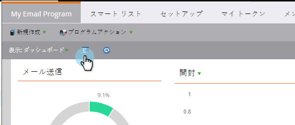

# 電子メールプログラムダッシュボードをExcelにエクスポート{#export-email-program-dashboard-to-excel}

電子メールプログラムを実行し、ダッシュボードにデータをいくつか含めたら、その生データをエクスポートしてExcelにエクスポートし、分析を高めることができます。 これが方法です。

1. **マーケティングアクティビティ**&#x200B;に移動します。

   

1. 電子メールプログラムを探して選択します。

   

   >[!NOTE]
   >
   >電子メールプログラムがまだ開始していない場合は、表示するデータがないので、ダッシュボードは表示されません。

1. Excelアイコンをクリックすると、エクスポートが開始されます。

   

   簡単だろ？
