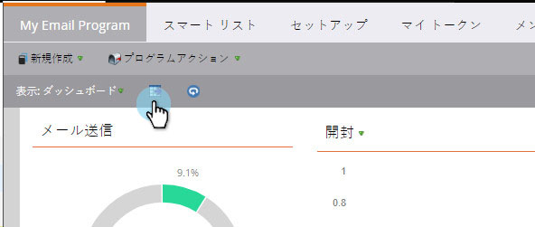

# メールプログラムダッシュボードを Excel に書き出す {#export-email-program-dashboard-to-excel}

メールプログラムを実行し、ダッシュボードにデータが表示されたら、その生データを Excel に書き出して、分析に役立てることができます。 手順は以下のとおりです。

1. **[!UICONTROL マーケティングアクティビティ]**&#x200B;に移動します。

   

1. メールプログラムを選択します。

   

   >[!NOTE]
   >
   >メールプログラムがまだ開始していない場合は、表示するデータがないので、ダッシュボードは表示されません。

1. Excel アイコンをクリックするだけで、書き出しが開始されます。

   

   簡単ですね。
