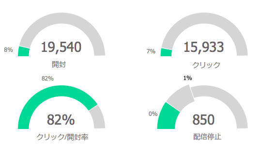
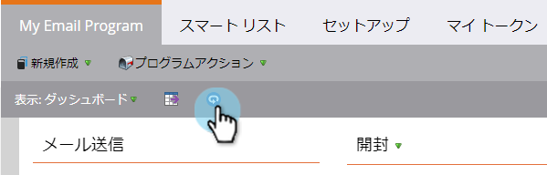

# 電子メールプログラムダッシュボード{#use-the-email-program-dashboard}を使用

[電子メールプログラム](http://docs.marketo.com/display/docs/email+programs)がこのダッシュボード表示でどのように動作しているかを調べます。

>[!NOTE]
>
>プログラムにA/Bテストがある場合は、[電子メールプログラムダッシュボード- A/Bテスト表示](../../../../product-docs/email-marketing/email-programs/email-program-actions/email-test-a-b-test/use-the-email-program-dashboard-a-b-test-view.md)を確認してください。

>[!NOTE]
>
>この表示のすべてのデータは集計です（A/Bテストと最終的な電子メール送信を含む）。

## 電子メール送信{#email-send}

ここでは、送信、バウンス、配信された電子メールの数を確認できます。

>[!NOTE]
>
>電子メールの配信品質の基準がマーケティング担当者の管理の外にあるため、バウンスと配信の統計は、正確ではなく、概算です。

## {#opens-clicks}を開く/クリック

このグラフは、電子メールプログラムが実行された後の特定の期間に開かれた、またはクリックされた電子メールの数を示します。

>[!TIP]
>
>時間が経つにつれて、開く/クリックの数がどのように減少するかを確認します。

## 概要 — エンゲージメント{#summary-engagement}

これは、全体的な[エンゲージメントスコア](../../../../product-docs/email-marketing/drip-nurturing/reports-and-notifications/understanding-the-engagement-score.md)を示します。

## 概要 — REST {#summary-rest}

残りのデータには、「開く」、「クリック数」、「クリック/開く比率」および「購読解除数」が表示されます。

>[!TIP]
>
>上の例の&#x200B;**Unsubscribe**&#x200B;の率は非常に小さかったので、Marketoがズームインして見た目を良くしました。 バー内の2番目の数字は、単に拡大・縮小のために追加されるだけです。

>[!NOTE]
>
>**定義**
>
>**電子メールの受信者が電子メールの画像（マーケティング担当者が挿入した追跡ピクセルを含む）をダウンロードすると**開きます。 受信者が電子メールを表示するが、その画像をダウンロードしない場合、それは開いているものと見なされません。 画像が受信者のプレビューペインに読み込まれる場合、通常は開いているものと見なされますが、電子メールクライアントによって異なります。
>
>**「開く」をクリックして、電子メール内で開かれ、リンクがクリックされた電子メールの割合を** 開きます。個別クリック数を個別オープン数で割って算出し、100を掛けて割合で表示します。

## ダッシュボードの更新{#refresh-dashboard}

最新のデータを表示するには、ダッシュボードの更新アイコンをクリックします。

>[!MORELIKETHIS]
>
>* [電子メールプログラムダッシュボードの使用 — A/Bテスト表示](../../../../product-docs/email-marketing/email-programs/email-program-actions/email-test-a-b-test/use-the-email-program-dashboard-a-b-test-view.md)

>

