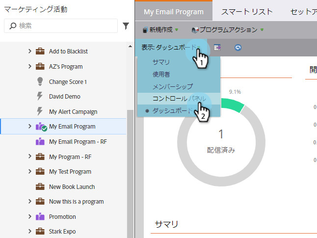
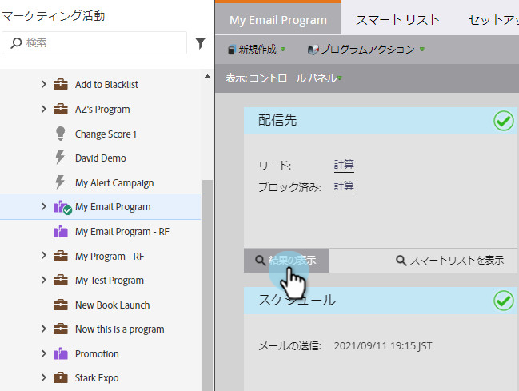

# 表示電子メールプログラムの結果 {#view-email-program-results}

スマートキャンペーンの「結果」タブと同様に、電子メールプログラムでも同じ情報を表示できます。

1. 「 **マーケティングアクティビティ**」に移動します。

   

1. 電子メールプログラムを探して選択します。

   

   >[!NOTE]
   >
   >電子メールプログラムが既に実行されている場合は、直接電子メールプログラムダッシュボードに移動します。

1. 「 **表示**」で、「 **Campaign コントロールパネル**」を選択します。

   

1. 「 **オーディエンス** 」タイルの下にある「 **表示結果**」をクリックします。

   

   あった！

   

>[!NOTE]
>
>**ディープダイブ**
>
>[電子メールプログラムについて詳しくは](http://docs.marketo.com/display/docs/email+program+actions)?

