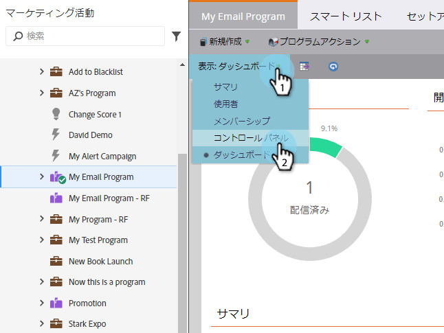
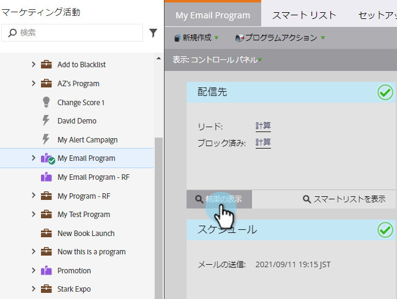

# メールプログラム結果の表示 {#view-email-program-results}

スマートキャンペーンの「[!UICONTROL 結果]」タブと同様に、メールプログラムにも同じ情報が表示されます。

1. **[!UICONTROL マーケティングアクティビティ]**&#x200B;に移動します。

   

1. メールプログラムを選択します。

   

   >[!NOTE]
   >
   >メールプログラムが既に実行されている場合は、メールプログラムダッシュボードに直接移動します。

1. **[!UICONTROL 表示]**&#x200B;の下で、「**[!UICONTROL コントロールパネル]**」を選択します。

   

1. **[!UICONTROL オーディエンス]**&#x200B;タイルの下で、「**[!UICONTROL 結果を表示]**」をクリックします。

   

   これで手順は完了です。

   
