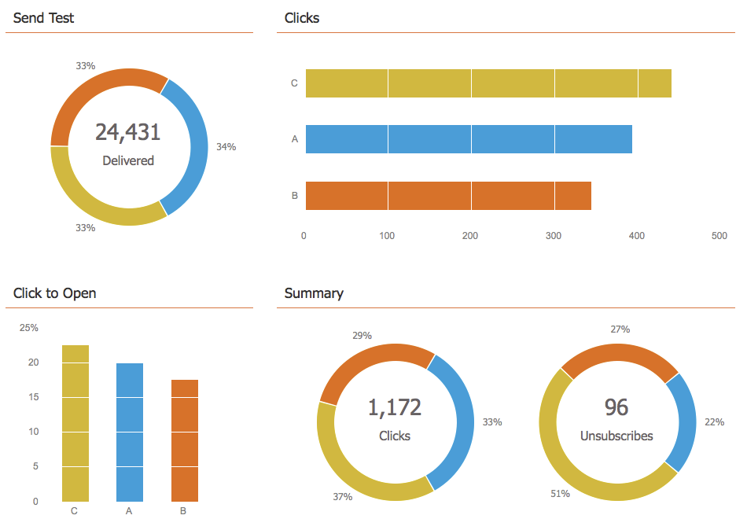
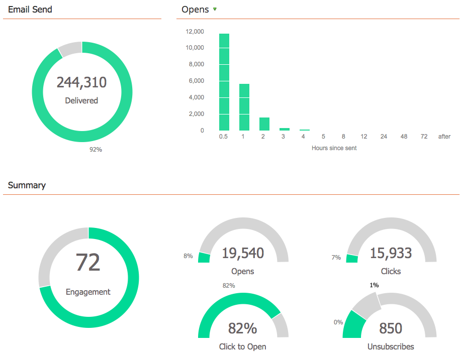

# メールプログラムダッシュボードの表示 {#view-the-email-program-dashboard}

ダッシュボードでは、メールプログラムのパフォーマンスを確認できます（A/B テストのあるなしに関わらず）。

>[!CAUTION]
>
>正確なレポートを作成するのに、スマートキャンペーンでメールを参照したり、起動したメールプログラムから新しいメールプログラムにアセットを移動したりして、メールプログラムからメールを&#x200B;_再利用_&#x200B;しないでください。 再利用すると、そのメールに添付されたすべてのレポートダッシュボードのすべてのデータが集計されます。 メールを再利用する必要がある場合は、代わりに[クローンを作成](/help/marketo/product-docs/core-marketo-concepts/programs/working-with-programs/clone-an-asset-in-a-program.md){target="_blank"}してください。これにより、メールがコピーされますが、新しいメール ID で新しいメールが作成されます。

## メールプログラムを選択します {#select-your-email-program}

1. **[!UICONTROL マーケティングアクティビティ]**&#x200B;に移動します。

   

1. メールプログラムを選択します。

   

   >[!CAUTION]
   >
   >A/B テストまたはメールプログラムがまだ開始されていない場合は、ダッシュボードは表示されません。

## メールプログラム A/B テストの表示 {#email-program-a-b-test-view}

A/B テストをメールプログラムに追加し、そのテストが現在実行中の場合は、次のようになります。

## メールプログラムの表示 {#email-program-view}

A/B テストを追加していない場合&#x200B;_または_&#x200B;テストが終了した場合は、次が表示されます。

>[!TIP]
>
>チャートウィジェットにカーソルを合わせてを実験します。 追加情報が表示されます。

>[!MORELIKETHIS]
>
>* [メールプログラムのダッシュボードを使用する：A/B テスト表示](/help/marketo/product-docs/email-marketing/email-programs/email-program-actions/email-test-a-b-test/use-the-email-program-dashboard-a-b-test-view.md)
>* [メールプログラムダッシュボードの使用](/help/marketo/product-docs/email-marketing/email-programs/email-program-data/use-the-email-program-dashboard.md)
