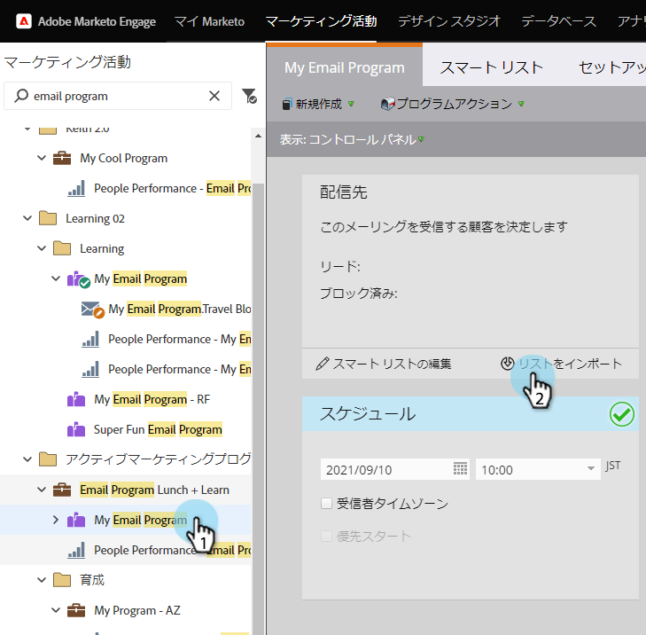
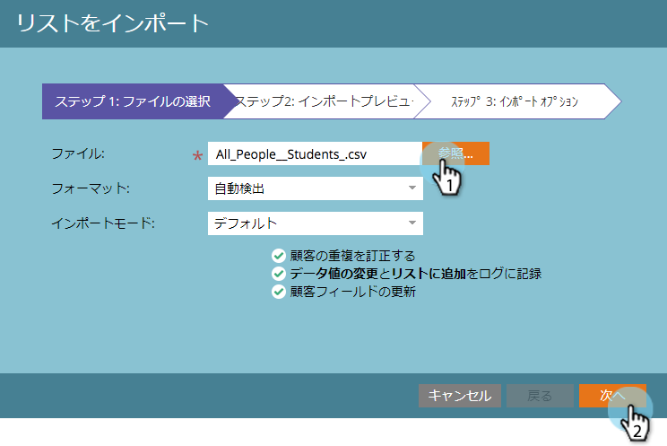
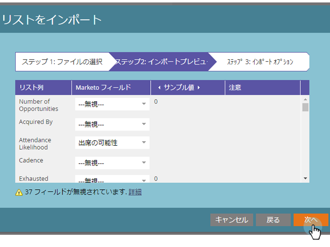
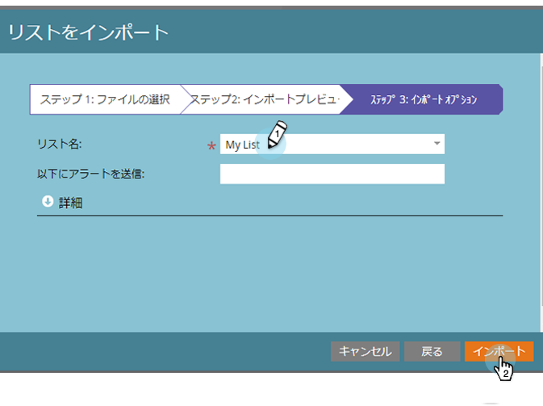
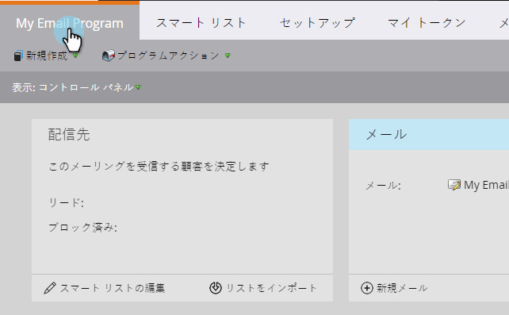

# リストのインポートによるオーディエンスの定義 {#define-an-audience-by-importing-a-list}

>[!NOTE]
>
>**前提条件**
>
>[電子メールプログラム用の電子メールの作成](../../../../product-docs/email-marketing/email-programs/email-program-actions/create-an-email-for-an-email-program.md)

電子メールプログラムを作成したら、電子メールの送信先を指定します。 これを行うには、スマートリストを [作成するか、リストを読み込みます](../../../../product-docs/core-marketo-concepts/smart-lists-and-static-lists/creating-a-smart-list/create-a-smart-list.md) 。 リストをインポートしてこれを実現する方法を次に示します。

>[!NOTE]
>
>オーディエンスの定義は、電子メールプログラムが承認されていない場合にのみ機能します。
>
>読み込まれる日付/時間フィールドは、すべて中央時間として扱われます。 別のタイムゾーンに日付/時間フィールドがある場合、Excelの数式を使用して中央標準時（米国/シカゴ）に変換できます。

1. 「 **マーケティングアクティビティ**」に移動します。

   

   電子メールプログラムを選択し、オーディエンスタイルの下にある「リストを読み込み」をクリックします。
   

1. リストの読み込みウィンドウが開き、「 **参照** 」をクリックして、読み込むファイルを選択します。 ユーザーのリストを選択したら、「次へ」をクリックします。
1. 

   >[!CAUTION]
   >
   >リストがUTF-8、UTF-16、Shift-JISまたはEUC-JPでエンコードされており、ファイルサイズが50 MBを超えていないことを確認してください。

   ファイル内のフィールドが正しくマッピングされていることを確認し、「Next」をクリックします。
   

   >[!TIP]
   >
   >今後のインポートで使用できるマッピングがマーケティング担当者に記憶されます。

1. リストの **名前** を入力し、「 **読み込み**」をクリックします。

   

1. 読み込みが完了したら、メインプログラムタブに戻ります。 資格を得る人の数が表示されます。

   

>[!NOTE]
>
>**定義**
>
>禁止番号に気づいた？ この数字は資格を持つ人のサブセットで、次の理由でこの電子メールを送信できない人を表します。
>
>* 登録解除
>* マーケティングの中断
>* ブロックリストに加える
>* 電子メールが無効です
>* 空の電子メール

>
>
通知をブロックしたユーザーの詳細リストを表示するには、その番号をクリックします。
>
>「  」タイルの — **** ボタンを使用して、スマートリストの基準に基づいて、電子メールの受信資格を得た人数を確認します。 Eメールを受信する人の合計数を取得するには、Blocked番号をPeople番号から引きます。

>[!TIP]
>
>リストのインポートが完了するまで待つ必要はありません。 好きなら働き続けていい。

素晴らしい！ これで、既に存在する電子メールを選択するか、新しい電子メールを作成してこれらのユーザーに送信するタイミングになります。

>[!NOTE]
>
>**関連記事**
>
>* [既存の電子メールの選択](../../../../product-docs/email-marketing/email-programs/email-program-actions/choose-an-existing-email.md)
>* [電子メールプログラム用の電子メールの作成](../../../../product-docs/email-marketing/email-programs/email-program-actions/create-an-email-for-an-email-program.md)

>

