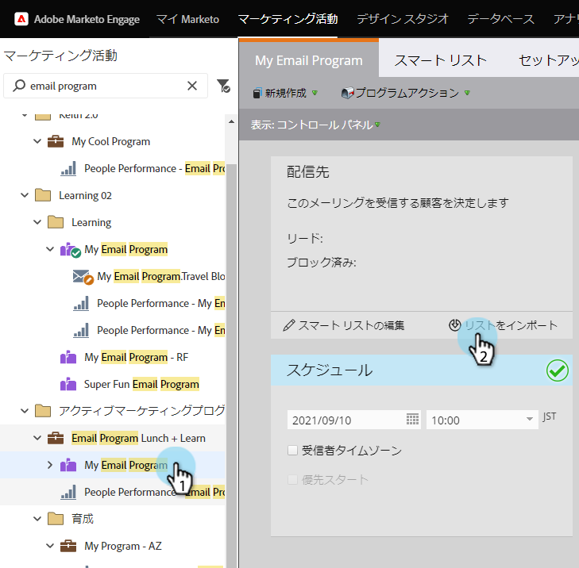
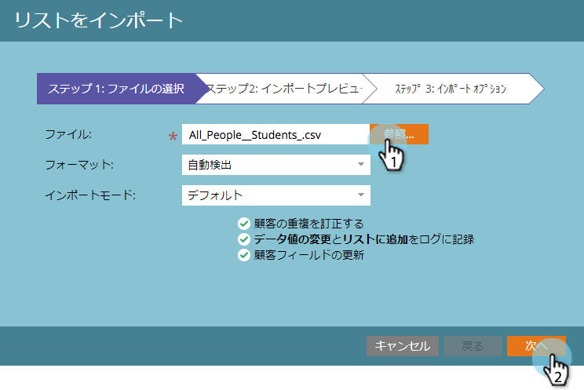
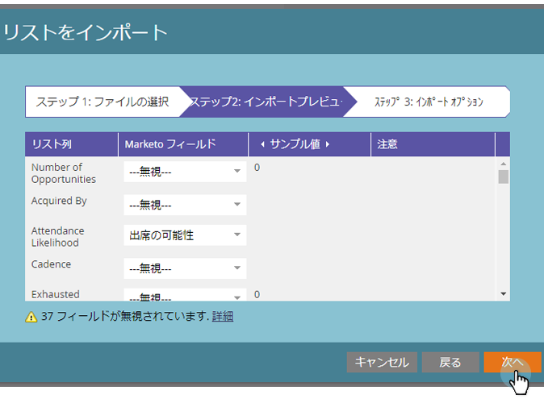
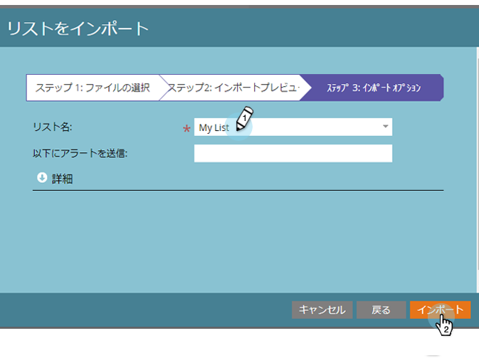
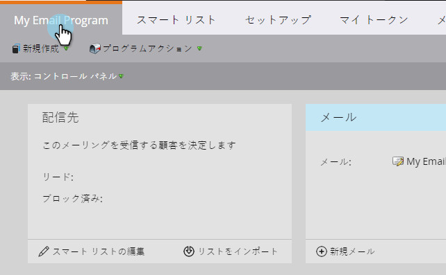

# リスト読み込みによるオーディエンスの定義 {#define-an-audience-by-importing-a-list}

>[!PREREQUISITES]
>
>[メールプログラム向け新規メールの作成](/help/marketo/product-docs/email-marketing/email-programs/email-program-actions/create-an-email-for-an-email-program.md)

メールプログラムを作成したら、メールを送信する相手を指定します。 それには、[スマートリストを作成](/help/marketo/product-docs/core-marketo-concepts/smart-lists-and-static-lists/creating-a-smart-list/create-a-smart-list.md)するか、リストをインポートします。 ここでは、リストをインポートする方法を説明します。

>[!NOTE]
>
>オーディエンスの定義は、メールプログラムが承認されていない場合にのみ機能します。
>
>読み込まれる日時フィールドは、すべて米中央時間として扱われます。 日時フィールドのタイムゾーンが異なる場合、Excel の数式を使用して、中央時刻（米国／シカゴ）に変換できます。

1. **[!UICONTROL マーケティングアクティビティ]**&#x200B;に移動します。

   

1. メールプログラムを選択し、「**[!UICONTROL オーディエンス]**」タイルの下部にある「**[!UICONTROL リストを読み込む]**」をクリックします。

   

1. リストをインポートウィンドウが開いたら、「**[!UICONTROL 参照]**」をクリックして、インポートするファイルを選択します。 リードのリストを選択したら、「**[!UICONTROL 次へ]**」をクリックします。

   

   >[!CAUTION]
   >
   >リストが UTF-8、UTF-16、Shift-JIS、EUC-JP のいずれかでエンコードされていて、ファイルサイズが 50MB を超えていないことを確認します。

1. ファイル内のフィールドが正しくマッピングされていることを確認し、「**[!UICONTROL 次へ]**」をクリックします。

   

   >[!TIP]
   >
   >Marketo は、それ以降のインポートで使用できるように、このマッピングを記憶します。

1. リストの「**[!UICONTROL 名前]**」を入力し、「**[!UICONTROL インポート]**」をクリックします。

   

1. インポートが完了したら、メインのプログラムタブに戻ります。 ここで、条件を満たすリードの数を確認します。

   

>[!NOTE]
>
>**定義**
>
>ブロック番号に気づきましたか。 この数は、条件を満たすリードのうち、以下の理由によりメールを送信できないサブセットを表します。
>
>* 配信停止完了
>* マーケティングを中断したリード
>* ブロックリスト掲載
>* メール無効
>* メールが空欄
>
>数字をクリックすると、このメール配信からブロックされているリードの詳細なリストが表示されます。
>
>**[!UICONTROL オーディエンス]**&#x200B;タイルの「」ボタンを使用して、スマートリストの条件に基づいて、メールの受信に適合する人数を確認します。 このリード数からブロック済みリード数を差し引いて、メールを受信するリード総数を算出します。

>[!TIP]
>
>リストのインポートが完了するまで待つ必要はありません。 必要であれば、別の作業を続けることができます。

簡単ですね。 次に、既存のメールを選択するか、新しいメールを作成してこれらのユーザーに送信します。

>[!MORELIKETHIS]
>
>* [既存のメールの選択](/help/marketo/product-docs/email-marketing/email-programs/email-program-actions/choose-an-existing-email.md)
>* [メールプログラム向け新規メールの作成](/help/marketo/product-docs/email-marketing/email-programs/email-program-actions/create-an-email-for-an-email-program.md)
