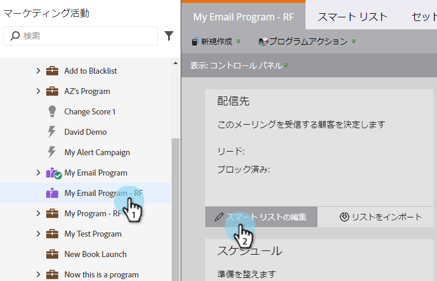

# スマートリストを使用してオーディエンスを定義する {#define-an-audience-with-a-smart-list}

[メールプログラムを作成](/help/marketo/product-docs/email-marketing/email-programs/creating-an-email-program/create-an-email-program.md)したら、メールを送信する相手を指定します。これは、[リードのリストをインポート](/help/marketo/product-docs/email-marketing/email-programs/managing-people-in-email-programs/define-an-audience-by-importing-a-list.md)するか、スマートリストを使用することで実行できます。スマートリストを使用する方法を次に示します。

>[!PREREQUISITES]
>
>[メールプログラムを作成する](/help/marketo/product-docs/email-marketing/email-programs/creating-an-email-program/create-an-email-program.md)>
>

>[!NOTE]
>
>オーディエンスの定義は、メールプログラムが承認されていない場合にのみ機能します。

1. 「**マーケティングアクティビティ**」に移動します。

   

1. メールプログラムを選択し、 「**オーディエンス**」タイルの下にある「**スマートリストの編集**」をクリックします。

   

   >[!TIP]
   >
   >この項目が表示されない場合は、「表示」が「**コントロールパネル**」に設定されていることを確認してください。

1. 使用するフィルターを検索し、キャンバスまでドラッグします。

   

1. フィルターを定義します。

   

1. フィルターの追加と定義が完了したら、メインのプログラムタブに戻ります。ここで、条件を満たすリードの数を確認します。

   

   できましたね。次に、これらのリードに送信するために、[既存のメールを選択](/help/marketo/product-docs/email-marketing/email-programs/email-program-actions/choose-an-existing-email.md)するか、[メールを作成](/help/marketo/product-docs/email-marketing/email-programs/email-program-actions/create-an-email-for-an-email-program.md)するかを選択します。

>[!NOTE]
>
>**定義**
>ブロック番号に気づきましたか。この数は、条件を満たすリードのうち、以下の理由によりそのメールを送信できないサブセットを表します。
>* 配信停止完了
>* マーケティングを中断したリード
>* ブロックリスト掲載
>* メール無効
>* メールが空欄

数字をクリックすると、このメール配信からブロックされているリードの詳細なリストが表示されます。**注意**：オペレーショナルなメールは、登録解除済みのリードとマーケティングを中断したリードに引き続き送信されます。
このメールを受け取るリードの数を確認するには、「オーディエンス」タイルの「」ボタンを使用します。

>[!MORELIKETHIS]
>
>* [既存のメールを選択する](/help/marketo/product-docs/email-marketing/email-programs/email-program-actions/choose-an-existing-email.md)
>* [メールプログラム向け新規メールの作成](/help/marketo/product-docs/email-marketing/email-programs/email-program-actions/create-an-email-for-an-email-program.md)

