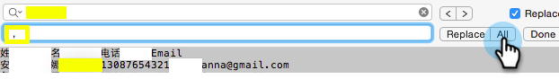

# 非ラテン文字リストの読み込み{#import-a-non-latin-characters-list}

英語以外のファイルをインポートしようとしている場合 Excelで開くと、リストが完璧に表示されます。

ただし、Marketoに読み込むと、英語以外の文字が正しく取得されないことがあります。

これは、ファイルがMarketorがラテン系以外の文字をすべて認識できるように適切に保存されないためです。 良い知らせは、いくつかの簡単な手順を実行して修正できることです。

1. **名前を付けて保存を選択…Excelの**&#x200B;ファイル&#x200B;**メニューの**。

   

1. 「**形式**」オプションとして「&lt;a0/>UTF-16 Unicodeテキスト(.txt)**」を選択します。**&#x200B;これにより、Marketorがファイルを表示できる方法でファイルがエンコードされます。

   

   >[!NOTE]
   >
   >また、UTF-8、Shift-JIS、EUC-JPもサポートしています。

1. 新しいファイルは、.txt拡張子を持つテキストファイルとして保存されます。 また、ファイル内のすべてのカンマがタブに変換されます。 変えなきゃ。

   >[!TIP]
   >
   >Windowsを使用している場合は&#x200B;**メモ帳**&#x200B;を使用し、Macを使用している場合は&#x200B;**TextEdit**&#x200B;を使用してテキストファイルを開くことができます。

   

1. ドキュメントからタブを選択し、コピーします。

   

1. **検索と置換を選択…**&#x200B;編集&#x200B;**メニューから**&#x200B;を選択します。

   

   >[!TIP]
   >
   >Windowsユーザーにとって、次の操作と同じです。**編集/置換…**

1. 手順4でコピーしたタブを最初の（置き換える）ボックスに貼り付け、2番目の（置き換える）ボックスにカンマを入力します。 「**すべて**」をクリックします。

   

1. カンマは全て戻りましたすぐに回れます

   

1. 新しいファイルをMarketoにインポートすると、この時点で情報が正しく表示されます。

   

   >[!NOTE]
   >
   >読み込まれる日付/時間フィールドは、すべて中央時間として扱われます。 別のタイムゾーンに日付/時間フィールドがある場合、Excelの数式を使用して中央標準時（米国/シカゴ）に変換できます。

奇妙だと分かっていますが機能します お気に入り！