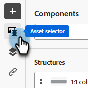

# 一時ドキュメント {#temp-doc}

## このパーツの下にコピー {#copy}

### Assetsを追加 {#add-assets}

Marketo Engage インスタンスの[画像とファイル ](/help/marketo/product-docs/demand-generation/images-and-files/add-images-and-files-to-marketo.md){target="_blank"} セクションに保存されている画像を追加します。

>[!NOTE]
>
>現時点では、新しいデザイナーにのみ画像を追加できます。他のファイルタイプは追加できません。

1. 画像にアクセスするには、アセットセレクターアイコンをクリックします。

   

1. 目的の画像を構造コンポーネントにドラッグ&amp;ドロップします。

   スクリーンショット

   >[!NOTE]
   >
   >既存の画像を置き換えるには、画像を選択し、右側の「設定」タブで「**アセットを選択**」をクリックします。

「コンディションコンテンツを有効にする」をクリックして動的コンテンツを追加し、コンディショナルルールに基づいてターゲットプロファイルにコンテンツを適応させます。

必要に応じて、詳細メニューから「コードエディターに切り替え」をクリックして、メールをさらにパーソナライズできます。 これにより、例えばトラッキングタグやカスタム HTML タグを追加するために、メールソースコードを編集できます。

注意
コードエディターに切り替えた後で、このメールのビジュアルデザイナーに戻すことはできません。

コンテンツの準備ができたら、「コンテンツをシミュレート」ボタンをクリックして、レンダリングを確認します。 デスクトップまたはモバイル表示を選択できます。

準備ができたら、「保存」をクリックします
