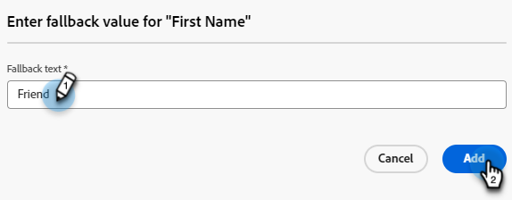

# メールテンプレート {#email-templates}

高速で改善された設計プロセスを実現するために、スタンドアロンメールテンプレートを作成して、カスタムコンテンツを簡単に再利用できます。

>[!IMPORTANT]
>
>この記事は、新Marketo Engageメールエディターベータ版のメンバーのみを対象としています。 普及させないでください。

>[!NOTE]
>
>新しいメールエディターのメールテンプレートは、新しいメールエディターでメールを作成する場合にのみ使用できます。 古いメールエディターでは参照できません。

## メールテンプレートの作成 {#create-an-email-template}

1. [Adobe Experience Cloud](https://experiencecloud.adobe.com/){target="_blank"} を使用して、Marketo Engageにログインします。

1. My Marketoで、「**Design Studio**」を選択します。

   

1. ツリーで、「**メールテンプレート （新しいエディター）**」を選択します。

   

1. 「**テンプレートを作成**」ボタンをクリックします。

   

1. テンプレート名とオプションの説明を入力します。 「**作成**」をクリックします。

   

## テンプレートをデザイン {#design-your-template}

_テンプレートをデザイン_ ページで、いくつかのオプションから選択できます。 [ ゼロからデザイン ](#design-from-scratch)、[ 独自のHTMLを読み込む ](#import-html) または [ 既存のテンプレートを選択 ](#choose-a-template) （サンプルまたは既に保存したテンプレートの 1 つ）からデザインします。


### ゼロからデザイン {#design-from-scratch}

シンプルなドラッグ&amp;ドロップ操作で構造要素を追加および移動してコンテンツを定義します。

1. _テンプレートをデザイン_ ページで、「**ゼロからデザイン**」を選択します。

1. [ 構造とコンテンツ ](#add-structure-and-content) を追加します。

### HTMLの読み込み {#import-your-html}

既存のHTMLコンテンツを読み込んで、メールテンプレートをデザインできます。 コンテンツには次のようなものがあります。

* スタイルシートが組み込まれたHTMLファイル

* HTMLファイル、スタイルシート（.css）および画像を含んだ.zip ファイル

>[!NOTE]
>
>.zip ファイル構造に制限はありません。ただし、.zip フォルダーのツリー構造に合わせて、相対参照を指定する必要があります。

1. _テンプレートのデザイン_ ページで、「**HTMLの読み込み**」を選択します。

1. 目的のHTMLまたは.zip ファイルをドラッグ&amp;ドロップし（またはコンピューターからファイルを選択し）、「**読み込み**」をクリックします。

   

   >[!NOTE]
   >
   >HTMLコンテンツがアップロードされると、コンテンツは互換モードになります。 このモードでは、テキストのパーソナライズ、リンクの追加、コンテンツへのアセットの追加のみを行うことができます。

1. メールDesignerのコンテンツコンポーネントを活用するには、「**HTMLコンバーター**」タブをクリックし、「**変換**」をクリックします。

   スクリーンショット

   >[!CAUTION]
   >
   >`<table>` タグを HTML ファイルの最初のレイヤーとして使用すると、上部レイヤータグの背景や幅の設定などのスタイルが失われる可能性があります。

読み込んだファイルを、必要に応じてビジュアルメールエディターでパーソナライズできるようになりました。

### テンプレートを選択 {#choose-a-template}

テンプレートには、次の 2 種類があります。

* **サンプルテンプレート**:Marketo Engageには、4 つの標準メールテンプレートが用意されています。

* **保存済みのテンプレート**：これらは、「テンプレート」メニューを使用してゼロから作成したテンプレートか、作成してテンプレートとして保存することを選択したメールです。

>[!BEGINTABS]

>[!TAB  サンプルテンプレート ]

メールテンプレートデザインですぐに使える標準テンプレートを 1 つ選択します。

1. 「サンプルテンプレート」タブは、デフォルトで開いています。

1. 使用するテンプレートを選択します。

   

1. 「**このテンプレートを使用**」をクリックします。

   

1. ビジュアルコンテンツデザイナーを使用して、必要に応じてコンテンツを編集します。

>[!TAB  保存済みテンプレート ]

1. 「**保存済みのテンプレート**」タブをクリックし、目的のテンプレートを選択します。

   

1. 「**このテンプレートを使用**」をクリックします。

   

1. ビジュアルコンテンツデザイナーを使用して、必要に応じてコンテンツを編集します。

>[!ENDTABS]

## 構造とコンテンツを追加 {#add-structure-and-content}

1. コンテンツの作成または変更を開始するには、構造からキャンバスに項目をドラッグ&amp;ドロップします。 右側のパネルで設定を編集します。

   >[!TIP]
   >
   >n:n 列コンポーネントを選択して、列数（3～10）を任意に定義します。 また、列の下に矢印を移動して、各列の幅を定義することもできます。

   

   >[!NOTE]
   >
   >各列のサイズを構造コンポーネントの全幅の 10% 未満にすることはできません。 削除できるのは空の列のみです。

1. 「コンテンツ」セクションから、目的の項目をドラッグして、1 つ以上の構造コンポーネントにドロップします。

   

1. 各コンポーネントは、「設定」タブまたは「スタイル」タブでカスタマイズできます。 フォント、テキストスタイル、余白などを変更します。

### Assetsを追加 {#add-assets}

```
ADD ASSETS OR ADD IMAGES? WHAT OTHER ASSETS CAN YOU ADD??
```

```
Access assets stored in the Assets library. IMAGES AND FILES ONLY?
```

1. 画像にアクセスするには、アセットセレクターアイコンをクリックします。

   スクリーンショット

1. 目的の画像を構造コンポーネントにドラッグ&amp;ドロップします。

   スクリーンショット

   >[!NOTE]
   >
   >既存の画像を置き換えるには、画像を選択し、右側の「設定」タブで **アセットを選択** をクリックします。

「条件付きコンテンツを有効にする」をクリックし、動的コンテンツを追加して、条件付きルールに基づいてコンテンツをターゲットプロファイルに適応させます。


必要に応じて、詳細メニューの「コードエディターに切り替え」をクリックしてコードエディターに切り替え、メールをさらにパーソナライズできます。 これにより、例えばトラッキングタグやカスタムHTMLタグを追加するために、メールソースコードを編集できます。

注意
コードエディターに切り替えた後で、このメールのビジュアルデザイナーに戻すことはできません。

コンテンツの準備が整ったら、「コンテンツをシミュレート」ボタンをクリックしてレンダリングを確認します。 デスクトップまたはモバイル表示を選択できます。

準備ができたら、「保存」をクリックします

### レイヤー、設定、スタイル {#layers-settings-styles}

```
ARE THEY CALLED LAYERS OR COMPONENTS
```

ナビゲーションツリーを開いて、特定の構造とその列/コンポーネントにアクセスし、より詳細な編集を行います。 アクセスするには、ナビゲーションツリーアイコンをクリックします。


次の例では、列で構成される構造コンポーネント内のパディングと垂直方向の整列を調整する手順を概説します。

1. キャンバスで構造コンポーネントの列を直接選択するか、左側に表示される _ナビゲーションツリー_ を使用して選択します。

1. 列ツールバーから _[!UICONTROL 列を選択]_ ツールをクリックし、編集する列を選択します。

   構造ツリーから選択することもできます。 その列の編集可能なパラメーターは、右側の _[!UICONTROL 設定]_ タブと _[!UICONTROL スタイル]_ タブに表示されます。

   

1. 列のプロパティを編集するには、右側の「_[!UICONTROL スタイル]_」タブをクリックし、必要に応じて変更します。

   * **[!UICONTROL 背景]** については、必要に応じて背景色を変更します。

     背景を透明にするには、このチェック ボックスをオフにします。 「**[!UICONTROL 背景画像]**」設定を有効にして、単色の代わりに画像を背景として使用します。

   * 「**[!UICONTROL 整列]**」では、「_上_」、「_中央_」または「_下_」アイコンを選択します。
   * **[!UICONTROL パディング]** については、すべての辺のパディングを定義します。

     パディングを調整する場合は、「**[!UICONTROL 各辺に異なるパディングを使用]**」を選択します。 _ロック_ アイコンをクリックして、同期を解除します。

   * 「**[!UICONTROL 詳細]**」セクションを展開すると、列のインラインスタイルを定義できます。

   

1. 必要に応じてこれらの手順を繰り返し、コンポーネント内の他の列の整列とパディングを調整します。

1. 変更を保存します。

### コンテンツのパーソナライズ {#personalize-content}

トークンは、古いバージョンで動作するのと同じように新しいエディターで動作しますが、アイコンの表示は異なります。 次の例では、代替テキストを使用した名トークンの追加について概説しています。

1. テキストコンポーネントを選択します。 トークンを表示する位置にカーソルを置き、「**パーソナライゼーションを追加** アイコンをクリックします。

   

1. 目的の [ トークンタイプ ](/help/marketo/product-docs/demand-generation/landing-pages/personalizing-landing-pages/tokens-overview.md){target="_blank"} をクリックします。

   

1. 目的のトークンを見つけて「**...**」アイコンをクリックします（「+」アイコンをクリックすると、代替テキストのないトークンが追加されます）。

   

   >[!NOTE]
   >
   >「代替テキスト」は、デフォルト値を表す新しいエディター用語です。 例：``{{lead.First Name:default=Friend}}``。選択したフィールドにその人物の値がない場合に備えてお勧めします。

1. 代替テキストを設定し、「**追加**」をクリックします。

   

1. 「**保存**」をクリックします。

### URL トラッキングを編集 {#edit-url-tracking}

メール内のリンクでMarketo トラッキング URL を有効にしたくない場合があります。 この情報は、表示先ページで URL パラメーターをサポートしていないためにページリンクエラーになる場合などに役立ちます。

1. リンクアイコンをクリックして、メール内のすべての URL を表示します。

   

1. 鉛筆アイコンをクリックして、目的のリンクのトラッキングを編集します。

1. **トラッキングタイプ** ドロップダウンをクリックし、選択を行います。

   

   ```
   LABEL?
   
   TAGS?
   ```

   <table><tbody>
     <tr>
       <td><b>mkt_tok を使用しないトラッキング</b></td>
       <td>定義</td>
     </tr>
     <tr>
       <td><b>mkt_tok を使用したトラッキング</b></td>
       <td>定義</td>
     </tr>
     <tr>
       <td><b>追跡しない</b></td>
       <td>定義</td>
     </tr>
   </tbody>
   </table>

1. 終了したら「**保存**」をクリックします。

### オプションを表示 {#view-options}

ビジュアルメールエディターで使用できる表示およびコンテンツの検証オプションを活用します。

* プリセットのズームオプションを使用して、コンテンツをズームイン/ズームアウトします。

* デスクトップ、モバイル、テキストのみ/プレーンテキストのいずれかでコンテンツを表示します。

   * デバイス間でコンテンツをプレビューするには、ライブビュー（目）アイコンをクリックします。

   * 標準提供のデバイスの 1 つを選択するか、カスタムサイズを入力してコンテンツをプレビューします。

### 詳細オプション {#more-options}

コンテンツエディターの **その他** オプションで、次の操作を実行できます。

スクリーンショット

* **テンプレートをリセット**：ビジュアルメールデザイナーキャンバスを空白のスレートにクリアし、コンテンツの作成を再開するには、これを選択します。

* **デザインを変更**:_テンプレートのデザイン_ ページに戻ります。 ここから、「[ テンプレートのデザイン ](#design-your-template) セクションで説明されている通りのアクションを実行できます。

* **書き出しHTML**：ビジュアルキャンバスのコンテンツを、zip ファイルとしてパッケージ化されたHTML形式でローカルシステムにダウンロードします。

## テンプレートの詳細を表示 {#view-template-details}

_メールテンプレート_ リストページで、メールテンプレートの名前をクリックして、詳細を表示します。

スクリーンショット

名前や説明などの基本的な詳細を編集できます。 編集したフィールドの外側をクリックして、変更を保存します。

**詳細** をクリックすると、テンプレートをすばやく削除または複製できます。

アクティブなアラート（メールテンプレートのエラー/警告）がある場合は、「アラート」をクリックして情報を表示します。

>[!NOTE]
>
>これらのアラートでは、メールの作成にメールテンプレートの使用は禁止されませんが、情報によって、機能しない可能性のある内容と、メールを配信に使用する前に必要な更新に関する可視性が提供されます。

## 参照別に使用される E メール テンプレートの表示 {#email-template-used-by-references}

メールテンプレートの概要で、「**使用者**」タブをクリックして、このメールテンプレートがMarketo Engage内で使用されている場所の詳細を表示します。

スクリーンショット

## メールテンプレートの編集 {#edit-email-templates}

このアクションは、次の場所から実行できます。

* 「詳細」タブ – 「**メールテンプレートを編集**」をクリックします。

* _メールテンプレート_ リストページ – 目的のメールテンプレートの「その他のアクション」アイコン（3 つのドット）をクリックし、「編集」を選択します。

```
THE SECOND ONE DOESN'T WORK IN MARKETO?? JUST LISTS DUPE AND DELETE
```

このアクションを実行すると、メールテンプレートが最後に保存されたステータスに基づいて、_テンプレートをデザイン_ ページまたはビジュアルコンテンツエディターページに移動します。 ここから、必要に応じてメールテンプレートのコンテンツを編集できます。 編集オプションについては、メールテンプレートの作成を参照してください。

## メールテンプレートの複製 {#duplicate-email-templates}

メールテンプレートを複製するには、次の 2 つの方法があります。

* 右側のメールテンプレートの詳細で、「**詳細**」をクリックし、「**複製**」を選択します。

スクリーンショット

* _メールテンプレート_ リストページで、目的のメールテンプレートの「その他のアクション」アイコン（3 つのドット）をクリックし、「**複製**」を選択します。

ダイアログで、一意の名前と説明（オプション）を入力します。 終了したら「**複製**」をクリックします。

複製されたメールテンプレートが _メールテンプレート_ リストページに表示されます。

## メールテンプレートの削除 {#delete-email-templates}

メールテンプレートを削除する方法は 2 つあります。

>[!CAUTION]
>
>メールテンプレートの削除は元に戻すことができません。

* 右側のメールテンプレートの詳細で、「**詳細**」をクリックし、「**削除**」を選択します。

スクリーンショット

* _メールテンプレート_ リストページで、目的のメールテンプレートの「その他のアクション」アイコン（3 つのドット）をクリックし、「**削除**」を選択します。

## 一括アクション {#bulk-actions}

_メールテンプレート_ リストページで、左側のチェックボックスをオンにして複数のテンプレートを選択します。 下部にバナーが表示されます。

**削除**：一度に最大 20 個のテンプレートを削除できます。 確認ダイアログでは、アクションを中止したり、削除を確認したりできます。

>[!MORELIKETHIS]
>
>[ メールオーサリング ](/help/marketo/product-docs/email-marketing/general/beta-new-email-editor/email-authoring.md){target="_blank"}：新しいエディターでメールを作成、デザイン、参照する方法について説明します。
