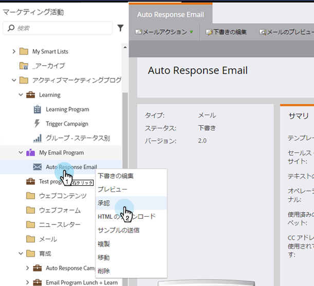

# 電子メールの承認{#approve-an-email}

ドラフト状態の電子メール開始。 一般に、システムでは、承認を行うまで使用できません。 電子メールを承認する方法はいくつかあります。

## 電子メールアクションメニュー{#approve-it-using-the-email-actions-menu}を使用して承認

1. 電子メールを探して選択し、**電子メールアクション**&#x200B;ドロップダウンをクリックして、**承認**&#x200B;を選択します。

   `   
`

## ツリーで直接承認{#approve-it-directly-in-the-tree}

1. 電子メールを探して選択し、右クリックして&#x200B;**承認**&#x200B;を選択します。

   

## 電子メールエディタでの電子メールの承認{#approve-your-email-in-the-email-editor}

1. 電子メールの&#x200B;**電子メールアクション**&#x200B;ドロップダウンをクリックし、**承認して閉じる**&#x200B;を選択します。

   

承認が完了すると、電子メールが使用できるようになります。
