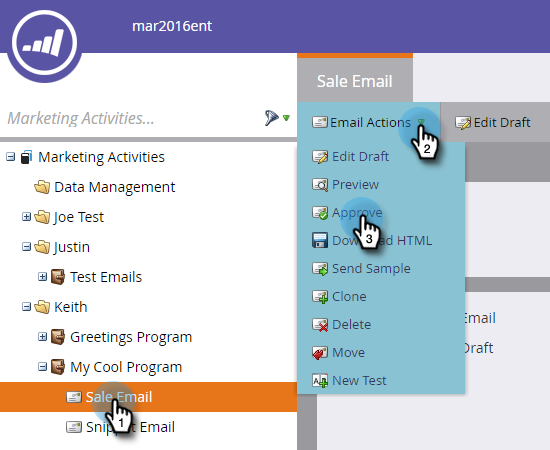
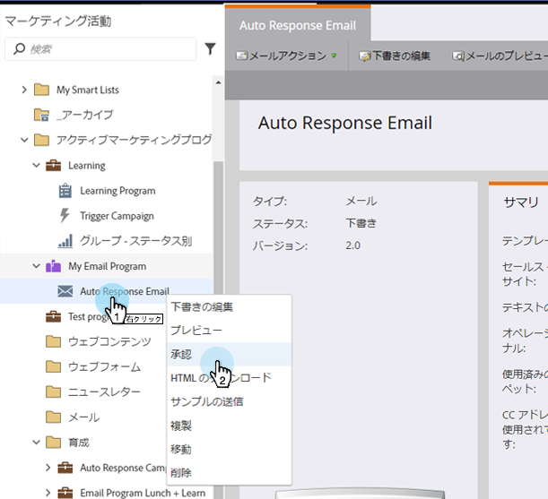

# メールの承認 {#approve-an-email}

メールはドラフト状態で開始します。通常は、ユーザーが承認するまで、システムでは使用できません。メールを承認するには、いくつかの方法があります。

## [!UICONTROL メールアクション]メニューを使用した承認 {#approve-it-using-the-email-actions-menu}

1. メールを検索して選択し、**[!UICONTROL メールアクション]**&#x200B;ドロップダウンをクリックして「**[!UICONTROL 承認]**」を選択します。

   

## ツリーで直接承認する {#approve-it-directly-in-the-tree}

1. メールを検索して選択し、右クリックして「**[!UICONTROL 承認]**」を選択します。

   

## メールエディターでメールを承認する {#approve-your-email-in-the-email-editor}

1. メールで、**[!UICONTROL メールアクション]**&#x200B;ドロップダウンをクリックして、「**[!UICONTROL 承認して閉じる]**」を選択します。

   

承認すると、メールは使用できるようになります。
