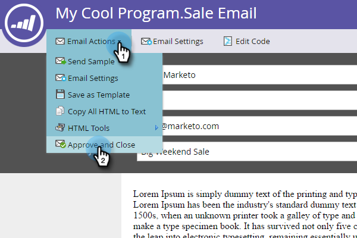

# 電子メールの承認 {#approve-an-email}

ドラフト状態の電子メール開始。 一般に、システムでは、承認を行うまで使用できません。 電子メールを承認する方法はいくつかあります。

## 電子メールアクションメニューを使用した承認 {#approve-it-using-the-email-actions-menu}

1. 電子メールを検索して選択し、 **電子メールアクション** (Email Actions **)ドロップダウンをクリックして、「**&#x200B;承認」を選択します。

   `   
`

## ツリーで直接承認 {#approve-it-directly-in-the-tree}

1. 電子メールを検索して選択し、右クリックして「 **承認**」を選択します。

   

## 電子メールエディターでの電子メールの承認 {#approve-your-email-in-the-email-editor}

1. 電子メールで、 **電子メールアクション** (Email Actions **)ドロップダウンをクリックし、「**&#x200B;承認して閉じる」を選択します。

   

承認が完了すると、電子メールが使用できるようになります。
