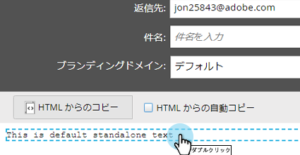
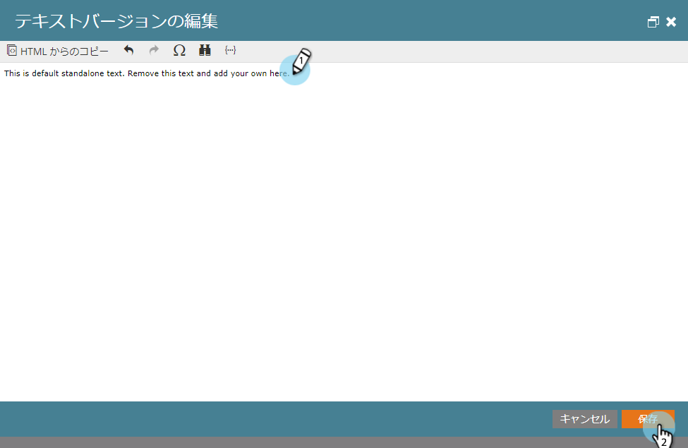

# テキストのみの電子メールの作成{#create-a-text-only-email}

テキストのみの電子メールを送信する場合は、次の方法で、HTMLコンテンツを一切含まない電子メールを作成します。

>[!NOTE]
>
>電子メールの画像（非表示の追跡ピクセルを含む）のダウンロード中に受信者が開封を追跡するので、開封は「テキストのみ」の電子メールで追跡できません。****

1. **マーケティングアクティビティ**&#x200B;エリアに移動します。

   

1. プログラムを選択し、「**新規**」ドロップダウンをクリックし、「**新規ローカルアセット**」を選択します。

   

1. 「**電子メール**」を選択します。

   

1. **名前**&#x200B;を入力し、テンプレートを選択して、**作成**&#x200B;をクリックします。

   

1. 電子メールエディターで、「**電子メール設定**」をクリックします。

   

1. 「**テキストのみ**」を選択し、「**保存**」をクリックします。

   

   >[!CAUTION]
   >
   >リンクは、テキストのみの電子メールでは自動的には追跡されません。 [テキスト電子メールへの追加追跡されたリンク](../../../../product-docs/email-marketing/general/functions-in-the-editor/add-tracked-links-to-a-text-email.md)の方法を参照してください。

   >[!TIP]
   >
   >また、既存の電子メールを編集し、この設定を変更することもできます。 その草案を承認するのを忘れないでください。

1. 「**HTML**&#x200B;から自動的にコピー」チェックボックスをオフにします。

   

   >[!NOTE]
   >
   >電子メールのHTMLセクションに追加されたコンテンツは、送信時に無視されます。

1. テキスト領域を重複キーを押しながらクリックします。

   

1. テキストを編集し、「**保存**」をクリックします。

   

それと同じくらい簡単だ。
